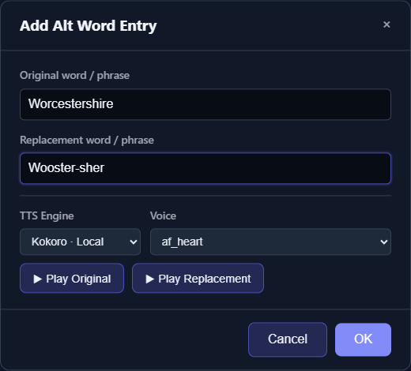

# Alternate Word Registry

The **Alt Word Registry** substitutes text immediately before chunks are sent to the TTS engine. Use it for names, abbreviations, or phrases that a selected voice consistently pronounces incorrectly.

The working manuscript remains readable while the engine receives the replacement.

## Add and test an entry

1. Open [Generate](app:generate).
2. Select **Alt Word Registry** below the input field.
3. Select **+ Add Entry**.
4. Enter the **Original word / phrase** exactly as it appears in the manuscript.
5. Enter the phonetic or expanded **Replacement word / phrase**.
6. Choose a **TTS Engine** and compatible **Voice**.
7. Compare **Play Original** with **Play Replacement**.
8. Select **OK**.

*Test the original and replacement with the intended engine and voice before saving the pronunciation rule.*

The registry table reports how many case-insensitive occurrences of the original text currently appear in **Input Text**. A zero count means the rule will not affect the current manuscript as written.

## Replacements are substrings, not whole words

> **Important:** Matching is literal and case-insensitive, but it is not limited to word boundaries.

An entry for `read` can also match the letters inside `bread` or `reading`. An entry for `US` can match those letters inside a longer word. Prefer enough surrounding context to make a rule specific:

| Risky | Safer when appropriate |
|---|---|
| `read` → `reed` | `read the letter` → `reed the letter` |
| `St` → `Saint` | `St.` → `Saint` |
| `US` → `United States` | `U.S.` → `United States` |

Punctuation is matched literally. Capitalization of the source does not matter, and the replacement is inserted exactly as entered rather than preserving the original capitalization.

## Order matters

Rules are applied sequentially in the order shown. The output of one rule can be matched again by a later rule.

For example:

1. `St.` → `Saint`
2. `Saint` → `Sainte`

The first rule creates text that the second rule changes again. Overlapping phrases can also produce unexpected results. Add longer, more specific phrases before shorter ones, and avoid replacement text that is another rule's original unless that cascade is intentional.

The current registry has no drag-to-reorder control. To change order, delete and recreate entries in the intended sequence.

## Registry lifetime

The Generate-page registry is session-only by default:

- Refreshing or reopening the page clears unsaved working entries.
- Saving with **Manage Projects** includes the current entries in that browser project.
- Loading the project restores them.
- Submitting a job stores the rules with the job so Library review and later regeneration can reuse them.
- Updating a completed Library item's registry does not retroactively change existing audio. Regenerate every affected chunk so the new rule is applied, then rebuild its chapter and the Full Story. Rebuilding alone only merges the existing audio files.

See [Save and Restore Projects](help:projects) and [Review and Regenerate Chunks](help:job-review).

## Use the smallest effective rule

A strong pronunciation workflow is:

1. Select the actual job engine and voice first.
2. Quick-test the full sentence without a rule.
3. Add a precise replacement.
4. Use **Play Original** and **Play Replacement**.
5. Test the full sentence again; isolated words can sound different in context.
6. Generate one representative chunk.

Phonetic spelling is engine- and voice-dependent. A rule that helps one voice may hurt another, especially when a project mixes languages or engines. Because one job-level registry applies before synthesis, use contextual phrases when different speakers need different pronunciation behavior.

## Avoid structural replacements

Do not use the registry to change:

- Speaker tag names or brackets
- Chapter-heading markup
- Large passages
- Text that should remain different for another speaker

Edit the manuscript directly for structural changes. Registry substitutions occur after text has already been divided for processing, so they are not a reliable way to create new speakers or chapter boundaries.

## Troubleshooting

- **Count is zero:** Check spelling, punctuation, and whether the term is present after LLM preparation.
- **A longer word changed:** The original rule matched a substring; make it more specific.
- **Replacement changed twice:** A later rule matched the output of an earlier rule; revise or reorder the entries.
- **Preview buttons are disabled:** Select a compatible voice.
- **Correct in preview, wrong in the job:** Test the full sentence and confirm the job uses the same engine and voice.
- **Rule disappeared after restart:** Restore a saved project or recreate it; unsaved Generate-page entries are session-only.

For corrections after generation, see [Fix Pronunciation, Pacing, Voice, and Merge Problems](help:audio-quality).
