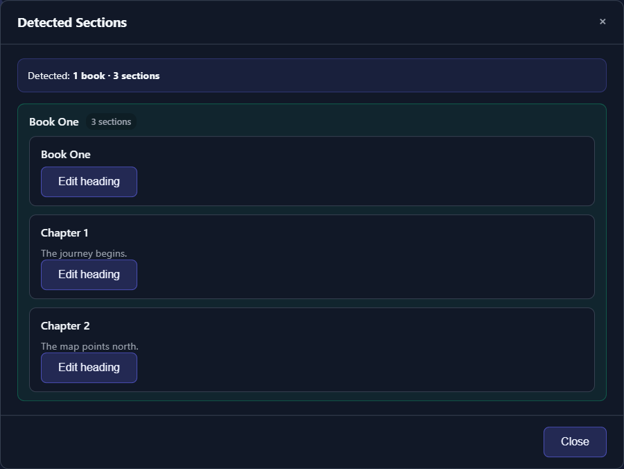

# Chapters, Books, and Sections

TTS-Story can detect heading lines and create separate audio files for books, chapters, or other logical sections. Detection is based on enabled heading terms, not on visual formatting from the original document.

## Prepare clear heading lines

Put each heading on its own line:

```text
Chapter 1: The Arrival

[narrator]The train appeared through the fog.[/narrator]

Chapter 2: The Letter

[narrator]By morning, an envelope waited at the door.[/narrator]
```

Leading speaker tags on the same heading line can still be cleaned for the display title, but simple standalone headings are easiest to review and maintain.

## Enabled heading terms

The Generate page provides default heading chips for:

- Book
- Chapter
- Section
- Letter
- Part
- Prologue
- Epilogue

Toggle terms off when ordinary prose beginning with that word creates false boundaries. Add a **custom heading** for a consistent marker such as `Episode`, `Volume`, or `Interlude`.

Custom phrases can include spaces and match flexible whitespace, but they should still appear at the start of a line. Use specific terms that are unlikely to begin normal prose.

## Review automatic detection

After automatic text analysis, the interface reports detected books or sections. Select **Review detected sections** to inspect the proposed structure.

Check:

- Number and order of books or sections
- Clean title text
- First and last lines of each section
- Whether front matter was attached to the intended section
- Whether a chapter word inside prose was mistaken for a heading
- Whether numbered or stylized headings were missed



*Review every detected title and boundary before requesting separate chapter files.*

Editing a heading in the review window changes that heading in **Input Text**, invalidates the old detection result, and refreshes analysis. This is a manuscript edit, so keep an external source copy.

## Separate files and combined output

Select **Intelligently create separate audio files for each book, chapter, or section** to request per-section output.

When enabled, **Also create a single full-length audiobook after section exports** requests a combined story in addition to the separate files. It does not replace them.

If no matching headings are found, TTS-Story falls back to a full-story section rather than inventing chapter boundaries. Review the detection message instead of assuming the checkbox alone guarantees separate files.

## Books containing chapters

When book headings are present, TTS-Story can build a book-to-chapter hierarchy. Review every level, especially for omnibus files where each book restarts chapter numbering.

Use consistent patterns, for example:

```text
Book One: Winter
Chapter 1: Snowfall
Chapter 2: The Crossing

Book Two: Spring
Chapter 1: The Thaw
```

Do not use an Alternate Word rule to create or rename section headings. Word substitutions occur later, immediately before synthesis, and are not intended to restructure the manuscript.

## Interaction with Prep Text

LLM preparation uses the same enabled heading terms when it builds its section list. An LLM can preserve, rewrite, wrap, or remove a heading depending on the prompt.

After **Prep Text**:

1. Compare headings with the source.
2. Wait for automatic analysis.
3. Open **Review detected sections** again.
4. Confirm book and chapter counts before generation.

See [Prepare Text with an LLM](help:prep-text) and [Prompt Presets, Chunking, and Review](help:llm-prompts).

## When detection is wrong

- **Missing section:** put the heading on its own line and enable its heading term.
- **False section:** disable the overly broad term or rewrite the line so it is not heading-like.
- **Wrong title:** edit it in the review window or directly in Input Text.
- **Duplicate sections after import:** remember that every document import appends; remove the duplicate text.
- **Unexpected full story only:** verify headings were detected before submission and that splitting was enabled.

For final chapter files, metadata, M4B, and timestamps, see [Audiobook Exports, Metadata, and Time Codes](help:audiobook-exports).
