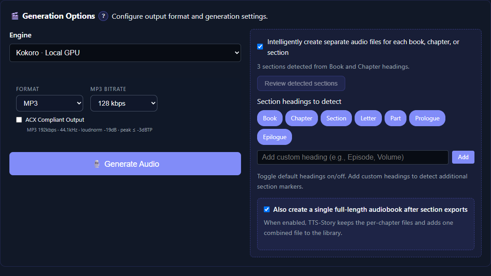

# Generation and Output Options

The **Generation Options** panel on [Generate](app:generate) defines how the current job is synthesized, encoded, and divided into files. These job-level choices can override saved defaults without rewriting Settings.

*Choose the job engine and output structure here after the manuscript and voices are ready.*

## Engine

**Engine** selects the TTS backend for this job. Choose it before assigning voices because each engine exposes different voice sources and controls.

Changing the saved default in Settings affects the initial choice for future work. Changing **Engine** here affects the submitted job. See [Engine Reference and Comparison](help:engine-overview).

## Format

- **MP3**: compact and widely compatible; suitable for listening and most distribution workflows.
- **WAV**: uncompressed review or editing file; much larger.
- **OGG**: compressed open format; support varies among players and publishing platforms.

The **MP3 Bitrate** control applies when MP3 is selected. Higher bitrates increase file size. Spoken-word material often needs less bandwidth than music, but always test the final delivery platform.

## ACX Compliant Output

When selected, TTS-Story applies ACX-oriented MP3 encoding and loudness/peak processing: 192 kbps constant bitrate, 44.1 kHz, a target around -19 dB integrated, and a true-peak ceiling below -3 dBTP.

> This processing helps meet technical audio targets; it does not guarantee that an audiobook will pass every ACX content, mastering, room-tone, chapter, metadata, or rights requirement.

ACX processing adds post-processing time and produces MP3-oriented output. Leave it off during rapid voice tests, then verify the final exported files with appropriate metering before submission.

See [Audiobook Exports, Metadata, and Time Codes](help:audiobook-exports).

## Chapter and full-story choices

**Intelligently create separate audio files for each book, chapter, or section** uses enabled heading terms to divide the manuscript. When it is enabled and headings are found, you can also select **Also create a single full-length audiobook after section exports**.

Review boundaries with **Review detected sections** before submitting. A mistaken heading can create an unwanted file boundary, and a missing heading can combine sections unexpectedly. Read [Chapters, Books, and Sections](help:chapters-and-sections).

## What is submitted

Selecting **Generate Audio** builds a job from the current:

- Input text
- Section-heading configuration
- Engine and engine-specific overrides
- Voice assignments and per-speaker controls
- Alternate Word Registry entries
- Format, bitrate, and ACX choice
- Chapter splitting and full-story choice

The job is then processed in the background. You may continue preparing another story without changing that submitted snapshot.

## Validation before queuing

TTS-Story checks the job in this order:

1. Input Text must not be empty.
2. Stale text is analyzed again.
3. Unmatched paired speaker tags block submission.
4. At least one valid voice assignment must be present. A tagged speaker without its own assignment inherits the first/default assignment, so review every card before submitting.
5. Engine and output choices are added to the request.

On success, the notification reports that the job is queued and shows its position. Open [Job Queue](app:queue) for progress.

## Start with a representative test

Before a full manuscript:

1. Use a passage long enough to create several chunks.
2. Include at least two speakers if the book is multi-voice.
3. Include one chapter boundary.
4. Include a difficult pronunciation or an Alternate Word rule.
5. Generate in the intended final format.
6. Review both individual chunks and the merged output in [Library](app:library).

For built-in and provider-catalog voices, a Quick Test proves only that a short request can synthesize. For reference/prompt engines, Quick Test only replays the source recording with its FX and does not synthesize at all. A representative job proves assignment collection, actual engine synthesis, chunk order, merging, encoding, chapter output, and provider limits.

## Output-size and time expectations

- WAV is much larger than compressed output.
- Higher MP3 bitrate creates larger files.
- More chunks increase synthesis requests and merge work.
- Creating both chapter files and a full story adds post-processing.
- ACX processing and M4B packaging add export time.
- The first local run can include model loading or downloading.

Use [Generation Time and ETA](help:generation-times) for practical estimation and [Audio and Generation Settings](help:settings-audio) for global tuning.
