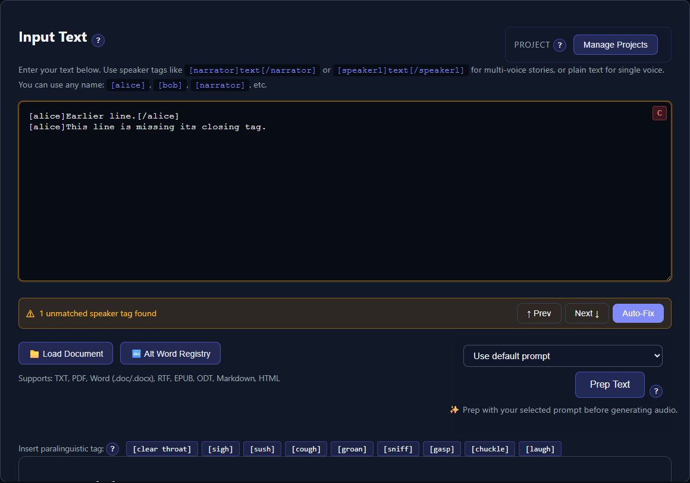

# Speaker and Expression Tags

Speaker tags divide a manuscript into passages that can use different voices. Expression or paralinguistic tags ask certain engines for a non-verbal sound or delivery cue. They use similar brackets but serve different purposes.

## Speaker tag format

Wrap every spoken passage in a matching opening and closing tag:

```text
[narrator]The room fell silent.[/narrator]
[alice]I thought everyone had gone home.[/alice]
[bob]Not everyone.[/bob]
```

Speaker names may contain letters, numbers, underscores, and hyphens. Do not put spaces or punctuation in the brackets. These are valid examples:

```text
[speaker1]...[/speaker1]
[mary-jane]...[/mary-jane]
[detective_2]...[/detective_2]
```

Use the same spelling for both halves of a pair. Tags are matched without regard to letter case during validation, but consistent lowercase names are easier to maintain and match elsewhere.

## Plain text is valid

You do not have to add tags to a single-voice story. When no paired speaker tags are detected, TTS-Story analyzes the manuscript as one speaker named **Speaker 1**. You must still assign that speaker a voice before generation.

## Keep passages simple and non-overlapping

Prefer sequential blocks:

```text
[narrator]She opened the letter.[/narrator]
[alice]This cannot be true.[/alice]
```

Avoid nesting one speaker inside another or leaving narration outside an otherwise tagged manuscript. Simple, balanced blocks make analysis, chunking, voice assignment, and later review predictable.

## The unmatched-tag warning

TTS-Story checks recognized speaker-tag pairs shortly after you type or paste. When it finds an orphaned or mismatched recognized tag, a warning appears above the input with:

- **Prev** and **Next** to move through the issues
- A highlighted affected tag or block
- **Auto-Fix** to insert a likely missing opening or closing tag



*The warning identifies unbalanced recognized speaker tags; review each location before using Auto-Fix.*

Generation is blocked while those unmatched speaker tags remain.

The validator distinguishes speaker tags from one-part expression cues such as `[laugh]` by treating a name as a speaker only when a closing form for that name appears somewhere in the manuscript. Consequently, a one-off opening tag such as `[alice]Hello there.` with no `[/alice]` anywhere is treated as an expression cue and may not trigger the warning. Before generating, search for every intended speaker's opening and closing forms manually, especially when that speaker appears only once.

> **Review every Auto-Fix.** It uses nearby tags and text boundaries to choose an insertion point. It can make the structure balanced without necessarily expressing the conversation you intended.

Typical corrections are:

```text
# Earlier valid pair establishes alice as a speaker
[alice]Earlier line.[/alice]

# Later passage is missing its close
[alice]Hello there.

# Corrected later passage
[alice]Hello there.[/alice]
```

```text
# Mismatch
[alice]Hello.[/bob]

# Corrected
[alice]Hello.[/alice]
```

## Rename a detected speaker

After analysis, each assignment card contains the speaker name and an **Apply** button. Enter a new name and select **Apply**. TTS-Story normalizes it to a tag-safe name, rewrites exact matching opening and closing tags in the input, and analyzes again.

Spaces become hyphens, uppercase becomes lowercase, and unsupported punctuation is removed. Review the rewritten manuscript, especially if similar speaker names exist.

## Expression and paralinguistic tags

The **Insert paralinguistic tag** bar shows buttons appropriate to the selected engine. Selecting a button inserts its bracketed cue at the current cursor position or replaces the selected text.

Examples can include:

```text
[alice]I suppose that is one way to solve it. [sigh][/alice]
```

Standalone tags such as `[laugh]` have no closing form and are not treated as speakers by the tag-balance checker. Support is engine-specific:

- Use only cues displayed for the current engine.
- Preview the exact sentence; unsupported cues may be ignored or spoken aloud.
- Do not assume a cue supported by Chatterbox, Kokoro, Qwen3, or OmniVoice has the same effect in another engine.
- Use cues sparingly. Repeated non-verbal generations can vary and may interrupt narration rhythm.

See the selected engine's guide, beginning with [Engine Reference and Comparison](help:engine-overview).

## Speaker tags created by an LLM

**Prep Text** can add or normalize speaker tags, but an LLM can also change names, omit a close, wrap too much narration, or rewrite the prose. When preparation finishes:

1. Compare the output with the source.
2. Resolve the unmatched-tag warning.
3. Review **Speakers** and possible duplicate names under **Text Statistics**.
4. Confirm that each passage belongs to the intended speaker.
5. Assign voices only after the tags are stable.

Read [Prepare Text with an LLM](help:prep-text) and [Analyze Text and Review Statistics](help:text-statistics) next.
