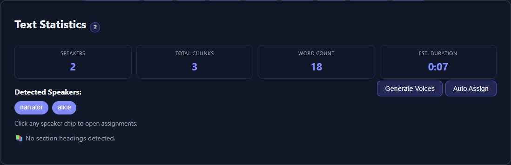

# Analyze Text and Review Statistics

TTS-Story analyzes **Input Text** automatically after you stop editing. The analysis drives voice assignments, chunk estimates, and section controls; it does not generate audio or consume speech-provider quota.

## Automatic analysis behavior

Analysis normally starts shortly after typing, pasting, importing, loading a project, renaming a speaker, or completing **Prep Text**. There is no separate **Analyze Text** button in the current Generate interface.

If you edit again while analysis is running, TTS-Story schedules another pass. Selecting **Generate Audio** also reanalyzes when the current text differs from the last successful analysis.

For a large manuscript, wait for the statistics and assignment cards to settle before making detailed voice selections.

## Read the four statistics

*Use these four values and the speaker chips below them as a quick plausibility check before assigning voices.*

### Speakers

The number of distinct paired speaker tags. If no paired tags are present, TTS-Story displays one speaker and creates **Speaker 1**.

Check the speaker chips below the cards. Similar spellings can create accidental duplicates, such as `mary-jane` and `mary_jane`. A possible-duplicates warning is advisory; inspect the manuscript before merging or renaming.

### Total Chunks

The approximate number of synthesis units after engine-aware text splitting. More chunks usually mean more requests, more transitions, and more opportunities for a cloud quota or local generation delay.

The final count can change with the selected engine, engine chunk size, section behavior, and edits made after analysis.

### Word Count

The words currently in the working field. Use it to catch unexpectedly empty, duplicated, truncated, or heavily rewritten imports and LLM output.

### Est. Duration

A speech-duration estimate based on the text. It is not a generation-time estimate and does not account precisely for every voice, speed setting, silence interval, expression, or later edit.

For processing-time guidance, read [Generation Time and ETA](help:generation-times).

## Speaker chips and assignments

Select a speaker chip to open its assignment details. The full **Assign Voices** area also appears below the statistics. For each speaker, confirm:

- The name is correct.
- The expected passages use that tag.
- A compatible voice is selected.
- Any reference sample, language, style, or instruction is appropriate.

The **Generate Voices** and **Auto Assign** buttons require detected tagged speakers. They are not needed for a plain-text **Speaker 1** job. See [Generate and Auto-Assign Voices](help:auto-assign-voices).

## Section detection

Analysis also checks the enabled heading terms, such as book, chapter, section, part, prologue, and epilogue. When headings are found, the interface reports detected books or sections and enables **Review detected sections**.

Do not infer correctness from the count alone. Review the titles and boundaries before generating separate files. See [Chapters, Books, and Sections](help:chapters-and-sections).

## Warning signs

Stop and inspect the input when:

- The speaker count is higher or lower than expected.
- **Speaker 1** appears even though you intended multiple voices.
- The word count differs greatly from the source.
- The chunk count jumps after selecting another engine.
- Similar speaker names appear as duplicates.
- No chapter headings are detected even though splitting is enabled.
- The unmatched-speaker-tag banner is visible.

Analysis can describe malformed or unintended text; it cannot determine whether the manuscript is editorially correct.

When the statistics are plausible, continue with [Assign and Test Voices](help:assign-voices).
