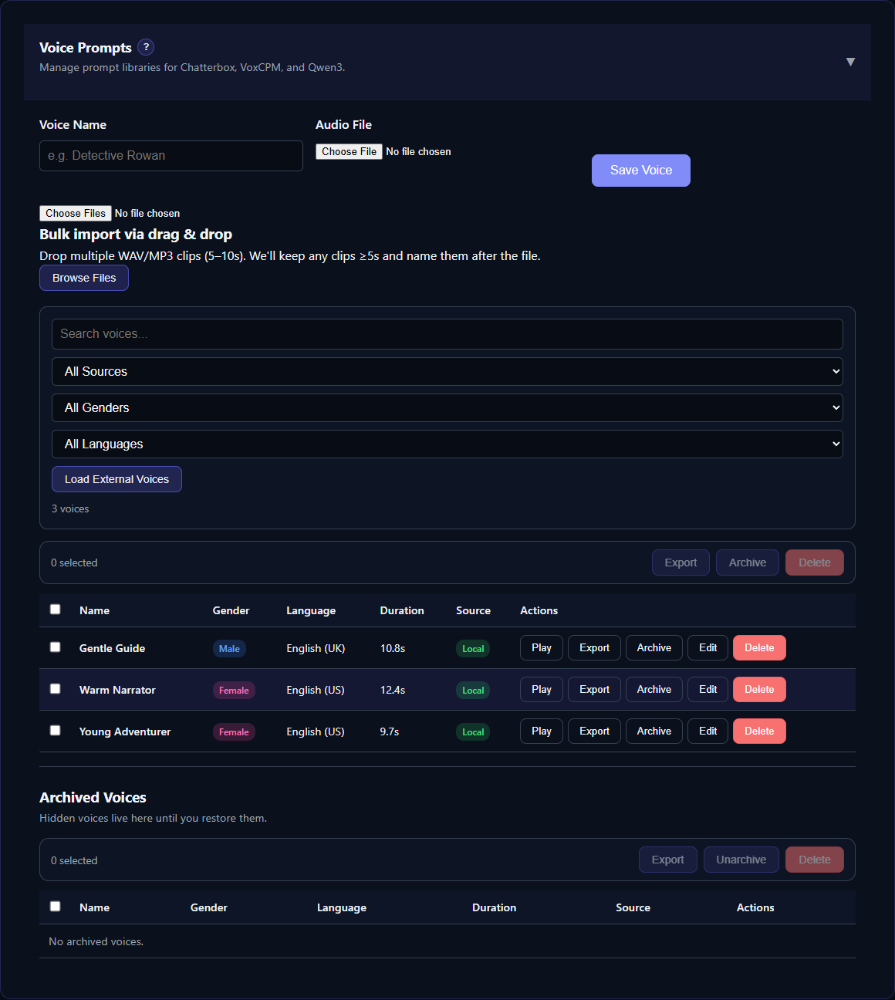

# Audio8 TTS

Audio8 TTS is a compact local 0.6B-parameter model that produces 44.1 kHz speech and supports zero-shot voice cloning. TTS-Story uses the Apache-2.0 `Audio8/Audio8-TTS-Preview-0.6b` release by default.

## Install and first use

Open [Settings → Engine Settings](app:settings/audio8-tts), select **Audio8 TTS**, and choose **Install Engine**. TTS-Story creates `engines/audio8_tts/.venv`; it does not change another engine's packages. The model weights download into Audio8's isolated model directory during the first generation, so that first request can take several minutes.

CUDA is recommended. CPU mode is available in float32 but can be too slow for audiobook-length work. The separately released ONNX runtime is not used by this initial adapter.

## Prepare a reference voice

Audio8 needs an exact transcript whenever you select a reference recording. In **Available Voices → Voice Prompts**, upload a clean single-speaker sample and enter its transcript or use **Generate Transcript**. Samples without transcripts remain in the library but cannot condition Audio8 cloning.

For best results, use a clean sample with no music, echo, overlapping speech, clipping, or heavy compression. Audio8 can also synthesize without a reference, but that path does not preserve a selected speaker identity.

## Settings

- **Model:** the official 0.6B preview model by default
- **Device and Precision:** Auto selects CUDA/BF16 when available and CPU/FP32 otherwise
- **Preferred Chunk Size:** 140 characters by default. This is a quality target, not a forced sentence break.
- **Sentence Hard Limit:** 400 characters by default. Complete sentences stay intact up to this ceiling; longer sentences split at punctuation or clause boundaries where possible.
- **Temperature, Top P, and Top K:** upstream sampling controls
- **Base Seed:** combined with chunk order for repeatable resume behavior
- **Maximum Output Tokens:** normal generation ceiling
- **Retry Output Tokens:** one larger retry if the model does not emit an end marker
- **Default Reference Voice and Transcript:** optional fallback for speakers without their own assignment

## Production guidance

Audio8 recommends inputs around 150 characters for best synthesis quality, but this is not a technical model limit. TTS-Story treats it as a preferred target and allows a complete sentence to continue to the configurable hard limit. The abbreviation-aware splitter avoids treating periods in forms such as `U.S.` or `Dr.` as automatic sentence endings. If a sentence exceeds the hard limit, TTS-Story prefers a natural clause boundary over an arbitrary character cut.

During a batch, Audio8 encodes each selected reference voice once and reuses those conditioning codes for later chunks from the same voice. Terminal diagnostics show the actual worker device and precision along with model-load, reference-encoding, generation, and waveform-decoding times. If Audio8 still fails to emit an end-of-speech marker after its retry, the chunk fails visibly instead of saving likely clipped audio.

Reference conditioning, speaker FX, pause markers, progress reporting, review, regeneration, and project assignments follow the same workflow as the other cloning engines. Generate a representative chapter before starting a full book.

## Languages and limitations

The preview is recommended for Cantonese, Chinese, Dutch, English, French, German, Italian, Japanese, Korean, Polish, and Spanish. It remains a preview checkpoint; noisy or inaccurate references can reduce stability and speaker similarity.

## Authoritative references

- [Audio8 TTS official repository](https://github.com/Audio8-AI/Audio8_TTS)
- [Audio8 TTS Preview 0.6B model card](https://huggingface.co/Audio8/Audio8-TTS-Preview-0.6b)
