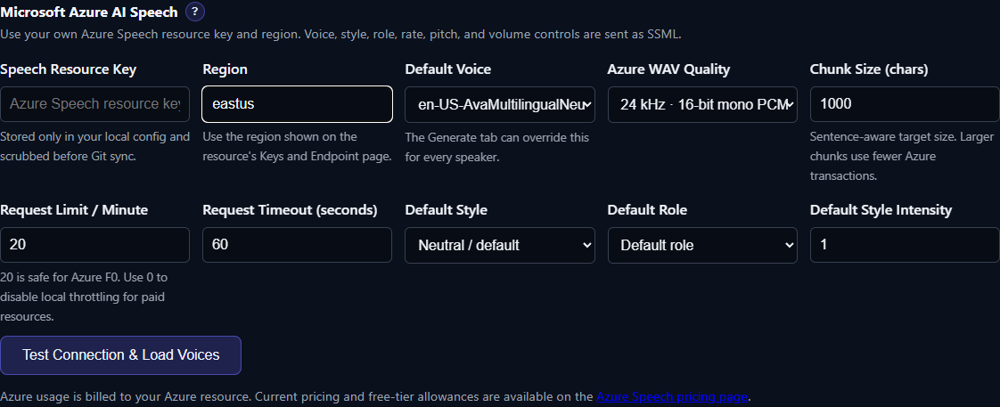

# Microsoft Azure AI Speech

Azure AI Speech is TTS-Story's supported Microsoft cloud option. It uses the Speech REST API directly and can discover neural voices for a resource region, including the styles and roles reported for each voice.

## Best for

- Production-oriented online speech with a documented service and quotas
- Large multilingual and regional voice catalogs
- Voices that support speaking styles or roles
- Provider-side rate, pitch, and volume through SSML
- Users who already manage an Azure subscription and Speech resource

No local inference GPU or model download is required. Every synthesis request needs internet access and a valid Azure resource.

## Create and connect a resource

*Enter the matching Azure key and region, then load the regional voice catalog before saving.*

1. In Azure, create an Azure AI Speech resource and review its pricing tier.
2. Open that resource's **Keys and Endpoint** page.
3. In [Settings → Engine Settings](app:settings/azure-speech), select **Azure Speech** and enter one resource key and the exact region shown by Azure, such as `eastus`.
4. Select **Test Connection & Load Voices**. A successful response replaces the initial fallback entry with voices returned for that region.
5. Choose a default voice, save settings, and make a short Quick Test before starting a job.

The key and region must belong to the same resource. A copied endpoint URL is not a substitute for the Region field. TTS-Story stores the credential in local configuration; do not share that file or include it in an issue report.

## Controls TTS-Story exposes

- **Default Voice:** `en-US-AvaMultilingualNeural` until a catalog is loaded or another voice is saved
- **Azure WAV Quality:** 24 kHz or 48 kHz, 16-bit mono PCM; this is provider/intermediate quality, while the final MP3/WAV/OGG choice is separate
- **Chunk Size:** 1000 characters by default; larger sentence-aware chunks reduce request count
- **Request Limit per Minute:** 20 by default, matching the conservative Azure F0 transaction limit; `0` disables TTS-Story's local throttle
- **Request Timeout:** 60 seconds by default
- **Default Style, Role, and Style Intensity:** populated only when supported by the selected voice
- **Per-speaker voice, style, role, style degree, rate, pitch, and volume:** TTS-Story escapes the text and builds SSML for the regional endpoint

A style or role listed for one voice may not work with another. Reload the voice catalog after changing credentials or region and re-check assignments.

## Effective-use tips

- Keep the 20-request local limit for an F0 resource. Raise or disable it only after checking the quota for the actual paid resource.
- Use 48 kHz only when its extra source quality matters; it increases data and processing without improving a low-bitrate final export by itself.
- Increase chunk size to reduce transactions, but shorten it if a request times out or a very long chunk loses desirable phrasing.
- Begin with neutral style, intensity `1.0`, rate `1.0`, pitch `0`, and volume `0`. Add one SSML control at a time.
- A `429` can mean quota, throttling, or temporary backend capacity. Lower request rate and retry later rather than immediately multiplying requests.
- Check current billing and free-tier allowances in Azure rather than assuming an old quota or price.

## Time, privacy, cost, and limitations

There is no model warm-up on this computer. Time consists of request throttling, network transfer, Azure synthesis, retries, and final local merging. The first catalog fetch can take a few seconds. At the default F0-safe limit, a many-chunk job is intentionally paced.

Text and SSML are sent to the resource's regional Azure Speech endpoint. Generated audio returns to TTS-Story for local post-processing and export. Charges and data handling are governed by the Azure account, selected region, tier, and current Microsoft terms.

TTS-Story does not create or train Azure Custom Neural Voice models. It uses voices returned by the REST catalog and only exposes styles/roles that catalog reports. Provider request-duration, SSML, content, and quota limits still apply.

## Authoritative references

- [Azure Speech text-to-speech quickstart](https://learn.microsoft.com/en-us/azure/ai-services/speech-service/get-started-text-to-speech)
- [Speech REST API](https://learn.microsoft.com/en-us/azure/ai-services/speech-service/rest-text-to-speech)
- [SSML voices, styles, roles, and prosody](https://learn.microsoft.com/en-us/azure/ai-services/speech-service/speech-synthesis-markup-voice)
- [Azure Speech language and voice support](https://learn.microsoft.com/en-us/azure/ai-services/speech-service/language-support?tabs=tts)
- [Speech quotas and limits](https://learn.microsoft.com/en-us/azure/ai-services/speech-service/speech-services-quotas-and-limits)
- [Azure Speech pricing](https://azure.microsoft.com/pricing/details/speech/)
