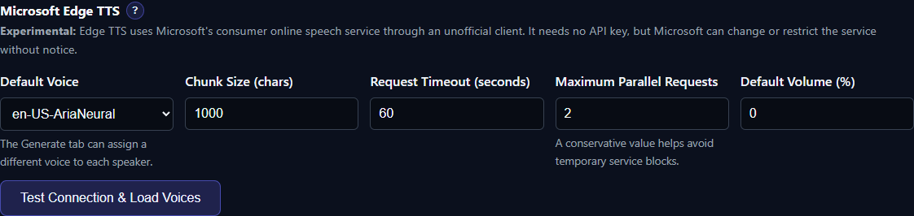

# Microsoft Edge TTS (Experimental)

Edge TTS gives TTS-Story access to Microsoft's current consumer online speech catalog without an API key. It is convenient for personal testing, but it uses an unofficial client and is not a supported Azure Speech replacement.

## Best for

- Trying a large online voice catalog without creating a cloud resource
- Personal projects and feature evaluation
- CPU-only computers that still have reliable internet access
- Users willing to tolerate service or protocol changes

Use [Azure AI Speech](help:engine-azure-speech) or another contracted provider when availability, support, billing records, and documented quotas are requirements.

## Requirements and setup



*Load the current Edge voice catalog, choose a default voice, and keep parallel requests conservative.*

The normal TTS-Story setup installs `edge-tts>=7.2.8,<8` in the main project environment and installs FFmpeg for conversion. A fresh computer therefore needs only the normal `setup.bat` or `install-update.bat` process; there is no separate Edge model, account, key, or GPU setup.

Edge TTS does require internet access every time it lists voices or generates speech. Open [Settings → Engine Settings](app:settings/edge-tts), select **Edge TTS**, and choose **Test Connection & Load Voices**. The current catalog is retrieved dynamically. Save a default voice and make a short test.

If the engine is reported as unavailable after an update, rerun setup and verify:

```bat
venv\Scripts\python.exe -m pip show edge-tts
```

## Controls TTS-Story exposes

- **Default Voice:** `en-US-AriaNeural` until another catalog voice is selected
- **Chunk Size:** 1000 characters by default
- **Request Timeout:** 60 seconds by default
- **Maximum Parallel Requests:** 2 by default; the UI permits 1–8
- **Default Volume:** provider-side adjustment from -100% to +100%
- **Per-speaker voice and speed:** speed is mapped to Edge's native rate range
- **Per-speaker pitch/tone FX:** applied by TTS-Story locally after the returned audio; they are not sent as custom Edge SSML

The adapter receives streamed MP3 data, converts it to 24 kHz mono WAV for TTS-Story processing, then applies the selected final output settings.

## Effective-use tips

- Keep parallel requests at 1 or 2. A high value can trigger temporary failures or service blocking and is rarely worth the risk.
- Match the voice locale to the manuscript language. Voice names that contain “Multilingual” still need listening tests for the specific language.
- Keep chunks moderate. Reduce the 1000-character target if requests time out or a voice loses pacing across long text.
- Use native speed and volume conservatively. Large local pitch or tone changes add another processing step and can create artifacts.
- Fetch the catalog again if a saved voice disappears. Microsoft can rename, add, or withdraw consumer voices.
- A failure that begins suddenly on every machine may require an updated `edge-tts` client or TTS-Story adapter rather than a settings change.

## Time, privacy, cost, and limitations

There is no local model download or GPU load. Generation time is mostly network latency, remote synthesis, retry behavior, and local conversion. It can be fast, but there is no service-level guarantee.

No API billing account is configured through TTS-Story, but “no key” does not mean offline or private: each text chunk is sent to Microsoft's consumer speech service. Users are responsible for deciding whether that boundary and the applicable service terms suit their content.

The upstream client explicitly depends on an undocumented consumer protocol. Microsoft can change authentication, throttling, voices, output, or access without notice. Custom SSML is not supported by the current `edge-tts` client, and TTS-Story cannot provide Azure-style quotas or support.

## Upstream implementation reference

- [rany2/edge-tts repository](https://github.com/rany2/edge-tts)
