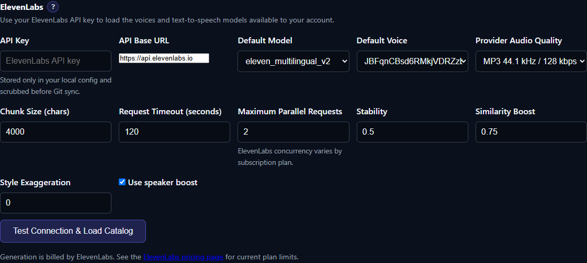

# ElevenLabs

ElevenLabs is a hosted text-to-speech option that uses the voices, models, quota, and concurrency available to your ElevenLabs account. TTS-Story loads that catalog dynamically and sends synthesis requests through the official REST API.

## Best for

- Polished hosted voices without local model downloads
- Account-managed voice libraries
- Multilingual models offered by ElevenLabs
- Long-form generation that benefits from adjacent-text continuity
- Users who understand their plan's character and concurrency limits

TTS-Story uses voices already present or accessible in the account. It does not create, clone, train, or delete ElevenLabs voices.

## Connect the account

*Load the account catalog before selecting the model, voice, and account-appropriate concurrency.*

1. Create an ElevenLabs API key with permission to read voices/models and perform text-to-speech.
2. In [Settings → Engine Settings](app:settings/elevenlabs), select **ElevenLabs** and enter the key.
3. Leave the Base URL at `https://api.elevenlabs.io` unless using an explicitly compatible endpoint.
4. Select **Test Connection & Load Catalog**. TTS-Story requests the account's voices, text-to-speech models, and subscription summary.
5. Choose a default model and voice, save, and run a short test.

Treat the API key like a password. TTS-Story stores it in local configuration; never paste it into a log, screenshot, project export, or GitHub issue.

## Controls TTS-Story exposes

- **Default Model:** initially `eleven_multilingual_v2`, then selectable from text-to-speech models returned for the key
- **Default Voice:** initially George, then selectable from account-accessible voices; each speaker can use a different voice
- **Provider Audio Quality:** MP3 44.1 kHz/128 kbps, MP3 44.1 kHz/192 kbps, or WAV 44.1 kHz; higher formats are plan-dependent
- **Chunk Size:** 4000 characters by default
- **Request Timeout:** 120 seconds by default
- **Maximum Parallel Requests:** 2 by default; actual concurrency depends on the subscription
- **Stability:** 0.5 by default
- **Similarity Boost:** 0.75 by default
- **Style Exaggeration:** 0 by default
- **Speaker Boost:** enabled by default

TTS-Story sends native speed between 0.7 and 1.2. If a requested project speed lies outside that range, the adapter applies the remaining speed change locally. For sequential chunks it also supplies adjacent text where possible to improve continuity.

## Effective-use tips

- Begin with the ElevenLabs-recommended baseline: stability 0.5, similarity 0.75, style 0, and speaker boost on.
- Lower stability for more expression and variation; raise it for consistency. Very high stability can sound monotone, while very low values can become unpredictable.
- High similarity can reproduce unwanted noise or artifacts associated with the source voice. Reduce it if clarity worsens.
- Style exaggeration adds latency and can reduce stability. Keep it at zero unless a controlled test is clearly better.
- Speaker boost can improve resemblance subtly but adds processing. Compare it with the same sentence rather than assuming it is always preferable.
- Keep parallel requests within the account limit. A `429` usually calls for lower concurrency or waiting for capacity, not repeated immediate retries.
- Choose a model that supports the intended language and features; voice access alone does not make every model suitable.

## Time, privacy, cost, and limitations

No local synthesis model is loaded. Time depends on network latency, ElevenLabs queue/concurrency, chunk count, selected model, and final local merge processing. Larger chunks use fewer requests, but overly long passages can reduce control and make a failed request more expensive to repeat.

Text is sent to ElevenLabs. Voice management and any source recordings used to create an account voice are governed by the ElevenLabs account and terms, not TTS-Story's local Voice Prompts library. Generation consumes account quota and may incur charges; plan limits and prices can change.

Some audio formats, models, voices, style controls, and concurrency levels are plan- or model-dependent. A catalog entry does not guarantee the current subscription can use every output format. TTS-Story reports provider errors but cannot raise account limits.

## Authoritative references

- [ElevenLabs text-to-speech best practices](https://elevenlabs.io/docs/overview/capabilities/text-to-speech/best-practices)
- [Voice settings](https://elevenlabs.io/docs/speech-synthesis/voice-settings)
- [Text-to-speech playground guidance](https://elevenlabs.io/docs/eleven-creative/playground/text-to-speech)
- [ElevenLabs model overview](https://elevenlabs.io/docs/overview/models)
- [List models API](https://elevenlabs.io/docs/api-reference/models/list)
- [ElevenLabs pricing](https://elevenlabs.io/pricing)
