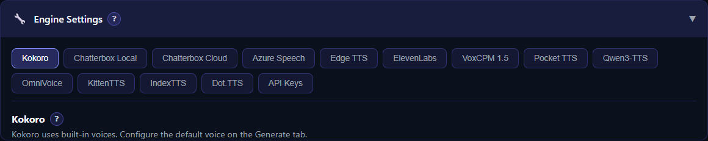

# LocalAI TTS

LocalAI TTS lets TTS-Story use models that are already installed and served by a separate [LocalAI](https://localai.io/) instance. LocalAI is an actual self-hosted AI server application—not just a generic phrase for “local AI.” It can expose speech models through OpenAI-compatible and LocalAI-specific API routes. Connecting it avoids installing a duplicate copy of the same TTS model inside TTS-Story.

## What the connection means

TTS-Story is the audiobook client and job manager. LocalAI owns the selected speech model, its runtime, GPU/CPU use, model downloads, built-in voices, and saved voice profiles. TTS-Story sends synthesis text and the selected voice information to that server, receives audio, and then performs its normal chunk tracking, pause/resume, effects, merging, and Library processing.

This connection does **not**:

- install LocalAI, Docker, or a TTS model for you;
- make every LocalAI model capable of speech or voice cloning;
- move a LocalAI model into TTS-Story's isolated engine folders; or
- delete LocalAI models or saved profiles when TTS-Story settings are changed.

LocalAI may run in Docker on the same computer, on another trusted computer, or on a server. “Self-hosted” describes who controls the service; text and selected reference audio still leave the TTS-Story process and travel to the configured LocalAI endpoint. Use authentication and trusted networking when the endpoint is not limited to the same computer.

## Connect LocalAI

*Open Engine Settings, choose LocalAI TTS, and load the live model and voice-profile catalog.*

1. Start LocalAI and confirm its web API is reachable.
2. Open [Settings → Engine Settings](app:settings/localai-tts) and select **LocalAI TTS**.
3. Enter the server address. The normal Docker default is `http://localhost:8080/v1`.
4. Enter an API key only if authentication is enabled on that LocalAI server.
5. Select **Test Connection & Load Catalog**.
6. Choose a discovered TTS model and voice profile, then save Settings.

After saving, the LocalAI chip turns green and **LocalAI TTS · Self-hosted** appears in Generate. TTS-Story does not show an Install/Uninstall action for LocalAI because its container, models, and dependencies are managed outside this project.

TTS-Story queries LocalAI's model-capability endpoint and lists only TTS-capable models when that endpoint is available. It also reads saved voice profiles and passes the selected `localai://voice-profiles/...` URI to the speech request. The exact voices and cloning controls therefore change with the selected LocalAI model.

Some LocalAI backends accept built-in voice names or speaker IDs but do not publish them through the voice-profile catalog. The catalog is therefore a suggestion list, not a restriction. In Settings or Speaker Properties, type the exact voice/speaker value required by the selected model. You may also supply an optional freeform language value (for example `en`, `fr-FR`, or `Japanese`); TTS-Story sends it as LocalAI's `language` request field. Leave it blank when the model uses a fixed language or automatic detection.

## Voice profiles and TTS-Story samples

The catalog includes profiles already managed by LocalAI. When the selected model advertises voice cloning, the main-page Speaker Properties selector also includes transcript-ready samples from TTS-Story's **Voice Prompts** library. Samples without transcripts are omitted from that selector until their text is entered or generated.

To use a TTS-Story sample:

1. Make sure the sample has an exact transcript in **Available Voices → Voice Prompts → Edit**. Generated samples are filled automatically when their original preview text is available. For missing text, use **Generate Transcript** on one sample or **Generate Transcripts** for a selected batch, then review the result.
2. In LocalAI TTS Settings, confirm that you have the rights or permission to use the sample for voice cloning.
3. Reload the catalog and select the TTS-Story sample as a default or speaker voice.

TTS-Story uploads only a selected sample when it is first used. LocalAI saves it as a persistent voice profile, and TTS-Story reuses that profile on later chunks and jobs. It does not upload the entire voice library or automatically delete profiles from LocalAI.

When a speaker already has a TTS-Story voice sample assigned, switching between LocalAI and another voice-sample-capable engine keeps that assignment whenever the same sample is available. Temporarily choosing an engine that does not use voice samples also leaves the assignment stored in the project, so it returns when you switch back. Selecting a different sample explicitly replaces the stored assignment.

Some LocalAI models have a built-in default voice. For those models, **Model default voice** can be left selected. Models such as OmniVoice can instead use an explicit saved profile. If the model does not advertise compatible custom-reference support, TTS-Story voice prompts remain unavailable for that model even when their transcripts are complete.

## Performance and concurrency

The model runs wherever LocalAI runs, not inside the TTS-Story Python environment. If LocalAI is on the same computer, its GPU and RAM use still affect TTS-Story. The default is one parallel request because many single-GPU LocalAI deployments cannot safely run several inference requests simultaneously.

Increase **Maximum Parallel Requests** only after a short test. LocalAI jobs are serialized with TTS-Story's local-engine jobs to avoid competing local GPU loads; the per-job request setting controls concurrency inside that job. Retries handle temporary timeouts and server errors per chunk. Pausing and resuming use TTS-Story's normal saved job position.

## Troubleshooting

- **No models:** Confirm the model is loaded in LocalAI and advertises the `tts` capability.
- **0 voice options:** This only means LocalAI did not advertise saved profiles. Type the model's voice name or speaker ID manually; use its model documentation or configuration as the source of truth.
- **No TTS-Story samples:** The selected model must advertise voice cloning. Add exact transcripts, confirm cloning rights in Settings, and reload the catalog.
- **Transcript required:** Edit the sample under Voice Prompts and enter exactly what is spoken in the clip.
- **Connection refused:** Start the LocalAI container and verify its published port. Docker commonly publishes port 8080.
- **Docker is running but unreachable:** Confirm the container publishes its API port to the host. The TTS-Story backend—not the browser alone—must be able to reach the configured address.
- **404:** Use the LocalAI server root or `/v1` base, not an unrelated dashboard URL.
- **Slow or failed concurrent generation:** Return parallel requests to 1 and inspect the LocalAI container log.
- **Remote server:** Replace `localhost` with the host's reachable address and configure LocalAI authentication before exposing it beyond a trusted network.

LocalAI TTS is separate from the **LM Studio** and **Ollama** choices under LLM Pre-Processing. Those options prepare or tag manuscript text. LocalAI TTS generates the final speech audio.
