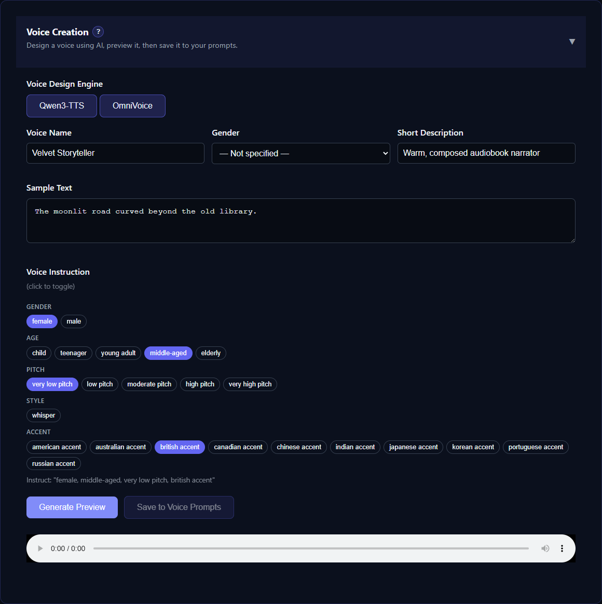

# OmniVoice: Clone and Voice Design

OmniVoice provides local multilingual voice cloning and instruction-based voice design through one model. TTS-Story runs it in an isolated environment so its PyTorch and Transformers requirements do not conflict with other engines.

## Best for

- Reference cloning across a very broad language catalog
- Local synthesis when multilingual coverage matters
- Creating an English- or Chinese-directed voice preview from attributes such as age, pitch, accent, dialect, or whisper style

**OmniVoice Clone** appears in the Generate engine list. **OmniVoice Design** is registered for [Voice Creation](help:voice-creation) and Library workflows rather than normal full-job selection.

## Requirements and setup

*Switch Voice Creation to OmniVoice to combine concrete voice attributes and audition a designed prompt.*

Install OmniVoice from its tab under [Settings → Engine Settings](app:settings/omnivoice). TTS-Story creates `engines/omnivoice/.venv`, installs the compatible runtime, and normally attempts to prefetch `k2-fsa/OmniVoice`. If prefetch was skipped or failed, first generation retries the several-gigabyte download.

CUDA is the practical choice for long jobs. The adapter also accepts `cpu`, `mps`, and explicit CUDA device names, subject to the installed runtime and hardware. Leave Device at `auto` initially. The default float16 dtype minimizes memory on compatible accelerators; use float32 only when necessary because it increases memory and time.

Do not install OmniVoice into TTS-Story's main `venv`; the isolated environment is intentional. If its setup failed, use **Install Engine** or uninstall and reinstall it from the OmniVoice settings tab rather than mixing dependencies manually.

## Controls TTS-Story exposes

Open [Settings → Engine Settings](app:settings/omnivoice) and select **OmniVoice**.

- **Model ID:** `k2-fsa/OmniVoice` by default
- **Chunk Size:** 500 characters for both clone and design workflows
- **Device** and **DType**
- **Performance Preset:** Fast, Balanced, or High Quality selects 16, 32, or 48 diffusion steps; Custom preserves another step value
- **Inference Batch Size:** 1 uses the least VRAM; 2 can improve long-job throughput on GPUs with enough free memory
- **Post-Process Output:** trims/manages sentence-boundary silence; disable it if short sentences run together unnaturally
- **Clone Default Prompt** and **Prompt Transcript:** Whisper transcribes locally when the transcript is blank
- **Design Default Instruction:** a comma-separated description such as “female, middle aged, low pitch, British accent”

Per-speaker reference prompts and transcripts override clone defaults.

During clone jobs, TTS-Story encodes each unique reference voice only once and reuses that prompt for every matching chunk. The encoded prompt is cached under the isolated OmniVoice engine so later jobs can reuse it when the model, source audio, and transcript have not changed. Changing any of those inputs creates a new cache entry automatically.

## Effective-use tips

- For cloning, provide clean, short, single-speaker audio and an exact transcript when possible. Automatic Whisper transcription is convenient, not infallible.
- Match reference and target language for the most stable identity. Test multilingual switching before a full job.
- Use Balanced for a 32-step baseline, then compare Fast on the same passage. For long audiobooks, Fast often provides the best throughput/quality tradeoff.
- Leave batch size at 1 when VRAM is limited. Try 2 only after a successful baseline; larger batches can use substantially more VRAM.
- Keep design descriptions concrete. Specify a few compatible traits rather than a narrative biography.
- Upstream reports voice design is trained primarily for Chinese and English and can be less stable in low-resource languages. Use cloning when preserving an identity matters more than inventing one.
- If pauses disappear, test with Post-Process disabled before altering global silence and crossfade settings.

## Time, privacy, and limitations

Initial setup or first use can take a long time because the isolated runtime and model are large. Each worker startup loads the model, the first use of a reference creates its encoded-prompt cache, and first inference may warm GPU kernels. Later chunks using that reference avoid repeated prompt encoding. CPU generation can be extremely slow.

The terminal reports model-load time, prompt-cache hits, per-batch inference time, generated-audio duration, and real-time factor (`rtf`). An RTF below 1 means synthesis is faster than the resulting audio's playback duration.

Once the model is cached, reference transcription and synthesis remain local with no per-character fee. Model and package downloads still require internet access.

“600+ languages” is an upstream model claim, not a promise of equal quality in every language, dialect, script, or code-switched passage. Voice Design is not exposed as a normal Generate job, and a designed preview must be saved and auditioned before reuse.

## Authoritative reference

- [k2-fsa OmniVoice official repository](https://github.com/k2-fsa/OmniVoice)
