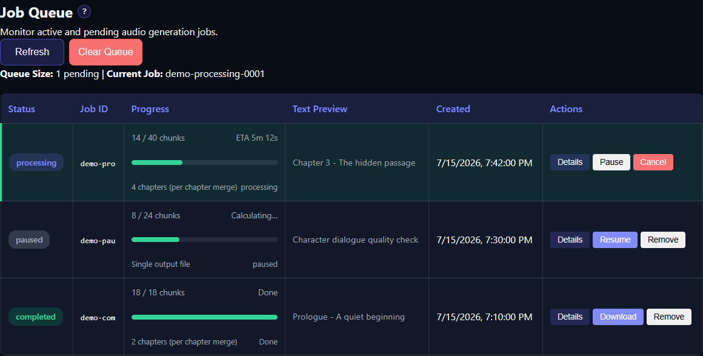

# Monitor the Job Queue

Every request submitted from Generate becomes a job. Open [Job Queue](app:queue) to see pending and active work. TTS-Story uses one background job worker, so separate jobs are handled one at a time even when an individual cloud engine can make parallel requests inside a job.

*Use the status, progress, and action columns to monitor each job without leaving the Queue page.*

The queue refreshes about every three seconds while its page is active. Refresh pauses when the page is hidden or while you are interacting with an editable control, preventing a refresh from interrupting your selection.

## Understand job states

- **Queued:** Waiting for the worker.
- **Processing:** Generating or post-processing audio.
- **Pausing:** A pause was requested and the job is reaching a safe chunk boundary.
- **Paused:** Work is saved and can be resumed.
- **Interrupted:** A previously active job was recovered after the application stopped and can be resumed.
- **Completed:** Output was finalized and should be available in Library.
- **Failed:** Processing stopped with an error.
- **Cancelled:** The job was intentionally stopped.

Progress may show processed chunks, total chunks, post-processing, and an ETA. It is normal for the ETA to be absent or unstable near the start of a job.

## Available actions

**Details** shows the engine, creation time, speakers, source text, progress, and available timing information.

**Pause** is available for queued or processing work. A processing job may remain in Pausing until its current safe unit finishes.

**Resume** continues a paused or interrupted job from its saved processed-chunk position.

**Cancel** stops queued or processing work. Use it when the input or voice assignment is wrong rather than allowing a long job to finish.

**Download** appears for completed output.

**Remove** removes the queue record when allowed. It does not delete completed Library audio. To delete generated files, use Delete in [Audio Library](app:library).

**Clear Queue** removes eligible queue records and skips an actively processing job. Read the confirmation before proceeding.

## Review happens in Library

The current Queue page is for monitoring and job control. Chunk editing and regeneration are not performed in the queue. When a job completes, open [Audio Library](app:library), choose a chapter or Full Story, and select **Review Chunks**. See [Review and Regenerate Chunks](help:job-review).

## If progress stops

1. Click **Details** and record the status and last processed chunk.
2. Check whether the page merely stopped refreshing by clicking **Refresh**.
3. If the job is paused or interrupted, use **Resume**.
4. If it failed, preserve the error and the job log before removing anything.
5. Test the same engine with a short paragraph to distinguish an engine/configuration failure from a manuscript-specific failure.

Use [Troubleshooting Checklist](help:troubleshooting-overview) for the next diagnostic steps.
