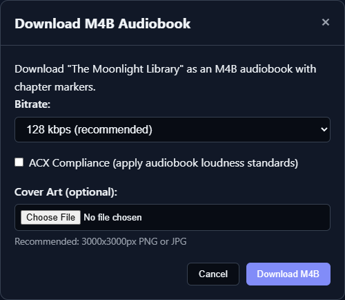

# Audiobook Exports, Metadata, and Time Codes

TTS-Story can produce a normal MP3, WAV, or OGG output during generation and can package completed chapter-mode projects as M4B audiobooks. Prepare and review the audio before making the final export.

## Normal downloads

Open [Audio Library](app:library) and use **Download** to retrieve the normal combined output. If the item has chapters, a chapter pill's **Download Chapter** action downloads that chapter, while the Full Story menu downloads the combined story when present.

The available normal format and bitrate were chosen on Generate when the job was submitted. Per-job generation choices override the global output defaults for that job. See [Generation and Output Options](help:generation-options).

## Edit audiobook metadata

Choose **Edit Metadata** and set any applicable fields:

- Title
- Author
- Genre
- Year
- Description

These fields are saved with the Library item and shown in TTS-Story. In the current M4B exporter, the title affects the downloaded filename, while Author, Genre, Year, and Description are not embedded in the M4B. Individual chapter titles and optional cover art are embedded during export.

## Build an M4B

**Download M4B** is shown for chapter-mode Library items. The export modal provides:

*Review the export options before encoding; the final M4B is built from the current chapter audio and markers.*

- AAC bitrate choices of 64, 96, 128, or 192 kbps;
- optional ACX-oriented loudness processing;
- optional cover art; and
- progress while encoding, merging, and adding chapter markers.

The default M4B bitrate is 128 kbps. Cover art is converted for embedding; a square PNG or JPEG around 3000 by 3000 pixels is recommended by the interface.

If the source job was already generated with ACX compliance, the M4B dialog disables the second ACX pass to avoid processing the audio twice.

M4B export requires FFmpeg. On Windows, setup places supported tools under the project's `tools` directory when download succeeds. If M4B creation fails, check [GPU, CPU, Model, and Dependency Errors](help:gpu-cpu-errors).

## ACX-oriented output

The Generate page's ACX option selects MP3 at 192 kbps and applies the application's loudness/peak processing profile. It is a processing aid, not a publishing guarantee. Listen to the complete output and validate it with the distributor's current requirements and suitable audio-analysis tools before submission.

ACX processing cannot repair clipping, room noise, a poor reference recording, mispronunciation, or inconsistent performance. Fix those at chunk level first.

## Generate video chapter time codes

Choose **Time Codes** on a chapter-mode Library card. TTS-Story reads the saved chapter durations and calculates chapter start times.

1. Enter the duration of any video intro in seconds.
2. Adjust **Drift adjust (s/chapter)** if timestamps accumulate a small offset over a long video.
3. Click **Calculate**.
4. Click **Copy** and paste the result into the video description.

The initial intro is 0 seconds and the drift adjustment defaults to 0.07 seconds per chapter. The output uses `HH:MM:SS` timestamps and numbered chapter labels. Compare several timestamps against the uploaded video before publishing; video encoding or a separately added intro can shift them.

## Final-export checklist

- Regenerate every corrected chunk.
- Rebuild affected chapters and the Full Story.
- Listen across chapter joins.
- Confirm the output filename, chapter titles, cover art, and the metadata saved with the Library item.
- Confirm the intended bitrate and format.
- Back up the completed Library directory before using Clear All.

For repair steps, see [Edit, Rebuild, and Repair Library Items](help:library-editing-repair).
