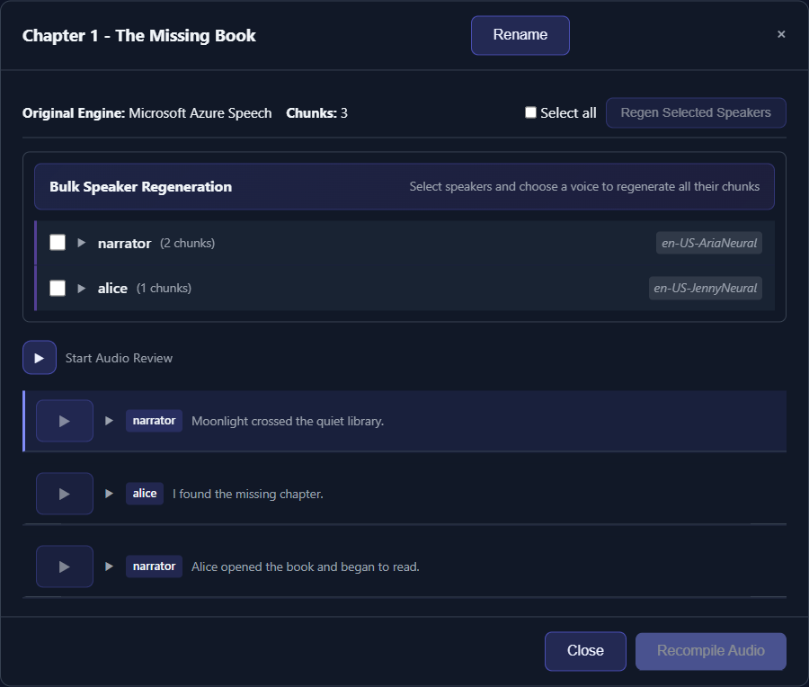

# Edit, Rebuild, and Repair Library Items

TTS-Story preserves individual chunk audio and review metadata so many completed jobs can be repaired without starting from the manuscript. The available repair depends on which source files still exist.

*The review modal keeps the saved text, voice, engine, effects, and playback controls together for targeted repairs.*

## Know the three operations

**Edit** changes saved text or metadata. Editing chunk text alone does not create new audio.

**Regenerate** calls a TTS engine to synthesize replacement audio for one or more chunks.

**Rebuild** merges the current saved chunk files into chapter and combined outputs. Rebuild does not synthesize speech.

This distinction prevents the most common repair mistake: regenerating a chunk, hearing the correction in review, and then downloading an older compiled chapter.

## Correct a completed item

1. Open [Audio Library](app:library).
2. Expand the item and choose a chapter or **Full Story**.
3. Select **Review Chunks**.
4. Locate and play the faulty chunk.
5. Edit its text or adjust its engine, voice, speed, pitch, or silence.
6. Click **Regenerate** and listen to the replacement.
7. Rebuild the affected chapter.
8. If a Full Story exists, use the card's **Rebuild** action to update all compiled outputs.

Bulk speaker regeneration is available, but first prove the chosen settings on one chunk. Cloud bulk regeneration can consume quota quickly.

Full Story review automatically restores the completed item to the internal review state when regeneration is requested. This is background bookkeeping; the current interface keeps you in the Library modal rather than sending you back to the Queue page.

## Use targeted rebuild controls

Inside chunk review, you can rebuild the current chapter or selected chapters. The Library card's **Rebuild** action rebuilds each chapter from its saved chapter chunks and independently rebuilds the Full Story from its saved full-story chunks. It does not use the newly compiled chapter files as the Full Story source.

Use Rebuild when:

- a regenerated chunk is absent from the downloaded chapter;
- a chapter or combined output is missing;
- compiled chapter audio needs refreshing; or
- chunk files play correctly but a merged file does not.

Rebuild can succeed only when the required chunk files still exist. It cannot reconstruct deleted or corrupt speech from text. Regenerate the missing chunk first when review metadata and an engine assignment remain available.

## Repair pronunciation without editing every chunk

Open **Alt Words** on the Library card, add the source and spoken replacement, save, then regenerate affected chunks. Because matching is a case-insensitive substring operation, verify that the source does not also occur inside unrelated words.

## Metadata and names

- Click the card title to rename the collection.
- Use a chapter's menu to rename that chapter.
- Use **Edit Metadata** for Title, Author, Genre, Year, and Description.

Metadata edits affect packaging and display. They do not change speaker tags, chunk text, or audio by themselves.

## When repair is no longer possible

If the Library item was deleted, its `static/audio/<job-id>` directory and associated files are removed. If individual chunks are missing and cannot be regenerated, restore the item from a filesystem backup or rerun generation from a saved manuscript/Project.

Projects are stored separately in browser local storage and are not a backup of generated audio or global settings. See [Save and Restore Projects](help:projects) and [Local Data, API Keys, and Backups](help:data-storage).
