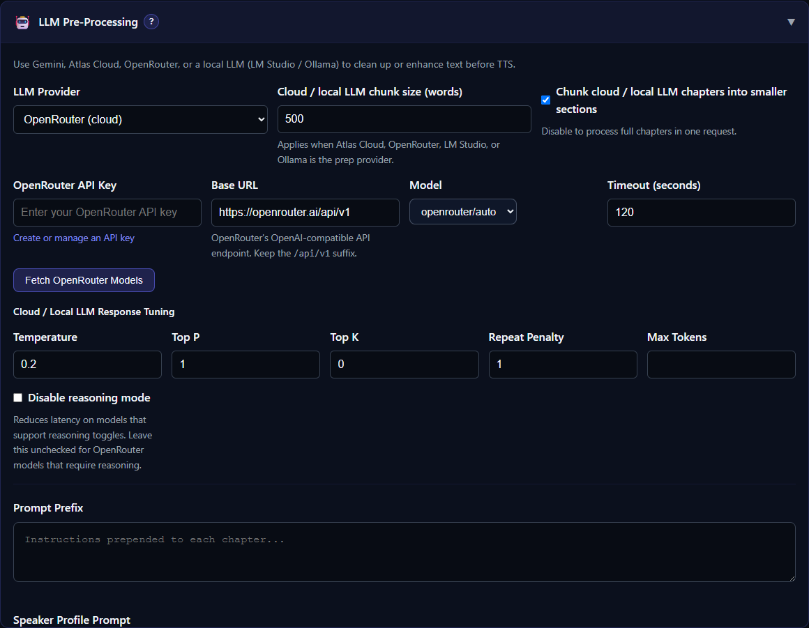

# Gemini, Atlas Cloud, and OpenRouter

TTS-Story supports three cloud providers for Prep Text. Each provider requires internet access, sends manuscript sections outside your computer, and may charge for usage.

Open [Settings](app:settings), expand **LLM Pre-Processing**, and select the provider before entering its credentials.

*Choose the cloud provider first; TTS-Story then reveals its credentials, model discovery, and request controls.*

## Gemini

Create and manage a key with the official [Gemini API key guide](https://ai.google.dev/gemini-api/docs/api-key).

1. Select **Gemini (cloud)**.
2. Enter the **Gemini API Key**.
3. Click **Fetch Models**.
4. Select an available model and click **Save Settings**.

Gemini has its own chunk-size and chapter-chunking controls. The initial model list in the interface is only a fallback; **Fetch Models** shows models available to the current key.

## Atlas Cloud

Review the official [Atlas Cloud model documentation](https://www.atlascloud.ai/docs/models/overview) before choosing a model or processing a long manuscript.

1. Select **Atlas Cloud (cloud)**.
2. Enter the **Atlas Cloud API Key**.
3. Keep the default Base URL, `https://api.atlascloud.ai/v1`, unless Atlas instructs you to change it. Preserve the `/v1` suffix.
4. Click **Fetch Atlas Models**.
5. Select a model and click **Save Settings**.

The initial fallback model is `deepseek-v3`, and the default request timeout is 120 seconds. A fetched catalog is preferable to typing a model name because it reflects what the current service exposes.

## OpenRouter

Review [OpenRouter authentication](https://openrouter.ai/docs/api-reference/authentication) and create a restricted key for TTS-Story where possible.

1. Select **OpenRouter (cloud)**.
2. Enter the **OpenRouter API Key**.
3. Keep the default Base URL, `https://openrouter.ai/api/v1`, unless OpenRouter instructs you otherwise.
4. Click **Fetch OpenRouter Models**.
5. Select a model and click **Save Settings**.

The initial fallback is `openrouter/auto`, and the default timeout is 120 seconds. OpenRouter models can have different prices, context limits, provider routing, and parameter support. Confirm the model and account policy before processing a full book.

## Shared cloud controls

Atlas Cloud and OpenRouter use the **Cloud / local LLM chunk size** and **Chunk cloud / local LLM chapters into smaller sections** settings. They also share response controls such as Temperature, Top P, Top K, Repeat Penalty, Max Tokens, and Disable Reasoning.

Start conservatively:

- keep Temperature near the default 0.2 for faithful cleanup;
- leave Max Tokens at 0 unless the chosen model needs an explicit limit;
- leave **Disable reasoning mode** unchecked for OpenRouter models that require reasoning; and
- reduce chunk size if requests time out or truncate responses.

See [Prompt Presets, Chunking, and Review](help:llm-prompts) before changing several controls at once.

## Credential safety

API-key fields are obscured in the browser, but saved keys are stored as plain text in the local `config.json`. Do not share that file, attach it to an issue, or commit a populated copy. Use a restricted key where the provider offers restrictions, monitor account usage, and revoke a key immediately if it is exposed.

The repository ignores `config.json` so saved settings and API keys remain local and do not interfere with updates. This safeguard does not make the file safe to distribute manually. See [Local Data, API Keys, and Backups](help:data-storage).

## If model discovery fails

- Re-enter the key without leading or trailing spaces.
- Verify the Base URL and required suffix.
- Confirm internet access and provider status.
- Check account billing, quota, and model permissions.
- Increase the timeout only when the provider is responding slowly; it will not fix authentication.

For status-code guidance, open [Cloud Credentials, Quota, and Network Errors](help:cloud-errors).
