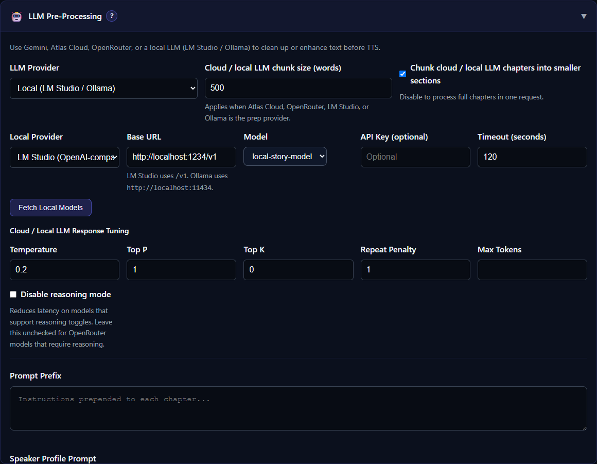

# LM Studio and Ollama

Local LLM preparation keeps requests on a local inference server instead of sending the manuscript to Gemini, Atlas Cloud, or OpenRouter. TTS-Story connects to the server; it does not install, launch, download, or configure the model for LM Studio or Ollama.

Use the official [LM Studio local server guide](https://lmstudio.ai/docs/developer/core/server) or [Ollama OpenAI compatibility guide](https://docs.ollama.com/api/openai-compatibility) to install and start the provider before configuring TTS-Story.

*Select the local provider, confirm its Base URL, fetch installed models, and save the chosen model.*

## Before configuring TTS-Story

In LM Studio or Ollama:

1. Install or download a model that can follow editing instructions.
2. Load the model if the provider requires it.
3. Start the local API server.
4. Keep the server running while Prep Text is active.

A model can be fully local while still consuming substantial RAM or VRAM. Leave enough resources for the TTS engine you intend to use later, or unload the LLM before speech generation.

## Connect to LM Studio

1. Open [Settings](app:settings) and expand **LLM Pre-Processing**.
2. Choose **Local (LM Studio / Ollama)** as the LLM Provider.
3. Choose **LM Studio (OpenAI-compatible)** as Local Provider.
4. Use `http://localhost:1234/v1` as the Base URL unless LM Studio shows a different port.
5. Add an API key only if your local server requires one.
6. Click **Fetch Local Models**, select a model, and click **Save Settings**.

TTS-Story normalizes LM Studio's OpenAI-compatible URL to include `/v1`, but entering the complete URL makes the configuration easier to verify.

## Connect to Ollama

1. Choose **Ollama** as Local Provider.
2. Use `http://localhost:11434` as the Base URL unless Ollama is listening elsewhere.
3. Click **Fetch Local Models**.
4. Select a locally installed model and click **Save Settings**.

Do not add `/v1` to the normal Ollama URL. The two local providers use different request formats.

## Test with a small section

Before processing a book, open [Generate](app:generate), paste a few paragraphs, and run **Prep Text** with a narrow prompt. Confirm that:

- a model appears in **Fetch Local Models**;
- the request completes before the configured timeout;
- the response contains only the revised manuscript text;
- speaker and chapter tags remain balanced; and
- the local server's console shows no context-length or memory error.

The default local timeout is 120 seconds. The shared cloud/local chunk size defaults to 500 words. A smaller chunk can reduce timeouts and memory pressure, while an excessively small chunk can remove context needed to identify the correct speaker.

## Common connection problems

**Connection refused** means the local server is not running, is on another port, or is bound to an address TTS-Story cannot reach.

**No models returned** usually means no model is installed/loaded, the wrong provider was selected, or the Base URL is incorrect.

**Request timed out** can mean the model is still loading, inference is too slow for the current timeout, or the chunk is too large.

**Out of memory** belongs to the LLM server, even if TTS-Story displays the resulting request failure. Reduce the model size or context, use CPU offload if the server supports it, or stop other GPU workloads.

For a structured diagnosis, see [GPU, CPU, Model, and Dependency Errors](help:gpu-cpu-errors).
