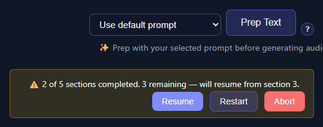

# Prompt Presets, Chunking, and Review

The safest preparation prompt is specific, limited, and testable. TTS-Story prepends the configured prompt to each section, so instructions must make sense when a model sees only part of a book.

## Write a fidelity-first prompt

A useful cleanup prompt should say what may change and what must remain unchanged. For example:

```text
Correct punctuation and obvious OCR spacing errors. Preserve every word,
proper name, heading, paragraph, and plot detail. Do not summarize, expand,
or censor the text. Return only the revised manuscript text.
```

If requesting speaker tags, define the exact tag format and explain how narrator text should be handled. Always inspect the result because a syntactically valid tag can still assign dialogue to the wrong speaker.

Avoid conflicting goals such as “preserve every word” and “rewrite for natural narration” in one preset. Use separate passes if both are genuinely required.

## Use presets

In [Settings](app:settings), expand **LLM Pre-Processing** and use **Prompt Presets** to save a named instruction. On [Generate](app:generate), select the preset beside **Prep Text**.

The Prompt Prefix is the general instruction used for processing. A selected preset supplies the preparation instruction for that run. The separate Speaker Profile Prompt guides the profile request made after text preparation; it does not rewrite the manuscript.

Save a Project before experimenting. Projects preserve the current editor text and selected prompt information, but they do not preserve global provider settings or API keys. See [Save and Restore Projects](help:projects).

## Choose chunk behavior

Gemini has separate chunk settings from Atlas Cloud, OpenRouter, LM Studio, and Ollama. Both groups default to 500 words and to splitting detected chapters into smaller sections.

Use smaller chunks when:

- the provider times out;
- the model truncates its response;
- local inference runs out of memory; or
- a chapter exceeds the model's context window.

Use larger chunks, or disable chapter sub-chunking, when correct speaker ownership depends on long context. Full chapters increase latency and the chance of hitting provider limits, so test one representative chapter first.

## Tune response controls carefully

The cloud/local response controls apply to Atlas Cloud, OpenRouter, LM Studio, and Ollama.

- **Temperature:** Lower values are usually more faithful. The default is 0.2.
- **Top P / Top K:** Restrict sampling. Leave defaults unless the selected model documents a reason to change them.
- **Repeat Penalty:** Can reduce loops but may also alter repeated names or refrains.
- **Max Tokens:** `0` lets the integration omit an explicit cap. A cap that is too small can truncate a section.
- **Disable reasoning mode:** May reduce latency on supporting models. Leave it off for models that require reasoning.

Change one setting at a time and rerun the same small sample.

## Pause, resume, restart, and abort



*Use these controls to stop safely between sections or continue a saved preparation run.*

Prep Text processes sections sequentially. Failures marked retryable by the provider, including HTTP 503 responses, are retried up to five times; authentication, validation, and other non-retryable failures stop immediately. **Pause** stops further progress, **Resume** continues saved progress, **Restart** clears that progress and starts again from section 1, and **Abort** abandons the active run.

Resume is tied to the current source text. Material edits can make saved progress unsuitable, so restart after changing the manuscript or prompt.

## Mandatory review

When processing completes, the generated result replaces the Generate editor contents. Before synthesis:

1. Compare the output with the saved source.
2. Search for proper names and numeric values.
3. Check every speaker tag pair.
4. Review text at section boundaries.
5. Confirm headings with **Review detected sections**.
6. Run a short Quick Test for each important voice.

Continue with [Prepare Text with an LLM](help:prep-text) or [Analyze Text and Review Statistics](help:text-statistics).
