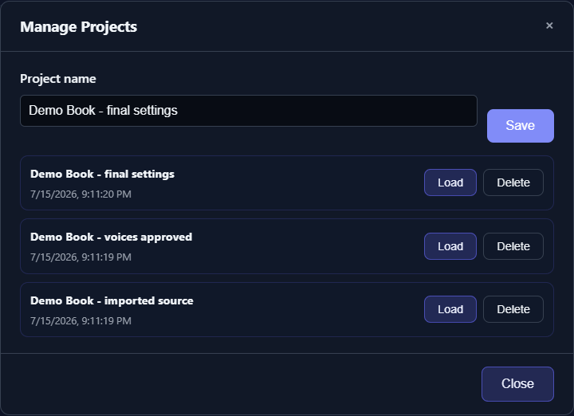

# Local Data, API Keys, and Backups

TTS-Story stores configuration, generated audio, jobs, prompts, models, and browser Projects in different locations. Backing up only the source repository does not preserve all user data.

## Main local data

| Location | Contents |
| --- | --- |
| `config.json` | Saved engine, audio, LLM, provider, and API-key settings |
| `static/audio/<job-id>/` | Generated chunks, chapters, combined audio, metadata, and per-job `job.log` |
| `data/jobs/` | Job database, job payload/metadata, and older job archive data |
| `data/voice_prompts/` | Uploaded, downloaded, and designed reference clips plus cached transcripts |
| `data/chatterbox_voices.json` | Friendly voice registry and prompt metadata |
| `data/custom_voices.json` | Custom Kokoro blend definitions |
| `data/prep/` | Saved Prep Text progress |
| `data/external_voices/` and related cache files | Downloaded/cataloged external voices |
| `static/samples/` | Generated catalog preview audio |
| `models/` and engine-specific model/cache directories | Downloaded local model data |

Some engines also maintain isolated environments or repositories under `engines/index-tts`, `engines/omnivoice`, and `engines/dots-tts`. Setup can rebuild those dependencies, but model downloads can be large.

## Browser Projects are separate

Generate-page Projects are stored in the browser's local storage under `tts-story-projects`. They preserve editor text, assignments, chapter/output choices, alternate words, speaker profiles, and related per-project state.



*Projects are browser-local working snapshots; they are separate from generated Library audio, global Settings, and filesystem backups.*

They do not contain global Settings or API keys, and they are not stored in the `data` directory. They can disappear if browser site data/profile storage is cleared or if TTS-Story is opened from a different browser profile or origin. There is no Project export/import action in the current interface.

Always keep the original manuscript as a normal file. Treat Projects as convenient working snapshots, not the only backup.

## API keys are plain text

Saved API keys are written as plain text inside local `config.json`, even though the browser fields use password-style masking. This includes configured Gemini, Atlas Cloud, OpenRouter, Replicate, Azure, ElevenLabs, optional local-server keys, and individual LLM backup-profile keys.

`config.json` is intentionally ignored by Git. Changing defaults no longer creates repository changes or blocks Install/Update. Existing installations upgrading from an older tracked configuration preserve and restore the local file during the transition.

If an installation from before this migration is already blocked with “local changes to `config.json` would be overwritten,” preserve the file once before pulling:

```powershell
Copy-Item config.json "$env:TEMP\tts-story-config-backup.json"
git restore config.json
git pull
Copy-Item "$env:TEMP\tts-story-config-backup.json" config.json -Force
```

After that update, future setting changes remain outside Git automatically.

- Do not attach `config.json` to a bug report.
- Do not place it in a public archive or shared cloud folder while populated.
- Do not commit a populated copy.
- Revoke and replace any key that was exposed.

The sync script scrubs known secret fields before staging the repository copy and the repository safety checker rejects known user-data paths. Those protections do not sanitize files you copy or upload manually.

## What source control intentionally excludes

The repository ignore/safety rules exclude generated audio, voice prompts, job/prep data, downloaded models, caches, local tools, isolated environments, credentials, databases, logs, and sync backups. Placeholder `.gitkeep` files are the exception.

This is why cloning the repository onto another computer does not restore your Library or voices. Running setup installs dependencies; it does not recreate personal data.

## Make a backup

1. Stop TTS-Story so databases and audio files are not changing.
2. Back up `static/audio` and the relevant `data` folders together.
3. Back up `config.json` only to encrypted/private storage, or remove all keys first.
4. Preserve original manuscript files separately because browser Projects are not portable exports.
5. Record the application revision and engine versions needed to reproduce the environment.

When restoring to another computer, install/update TTS-Story first, stop it, restore user-data folders to the same relative locations, and then start the application. Keep an untouched copy until the Library and prompt catalog have been verified.

See [Save and Restore Projects](help:projects) and [Prepare a Useful Issue Report](help:report-an-issue).
