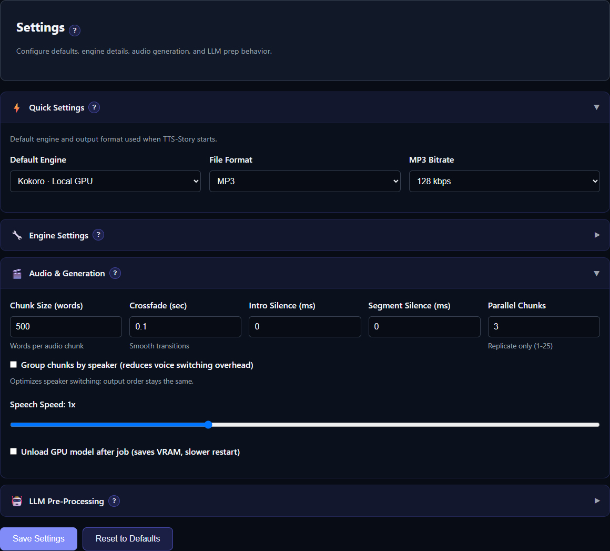

# Settings Reference

[Settings](app:settings) contains persistent defaults and provider configuration. Choices made directly on Generate are job-specific and override the corresponding default for that submitted job.

*Choose the application defaults at the top, configure the relevant engine or provider section, and save before testing.*

## Quick Settings

Quick Settings selects the default TTS engine, output format, and output bitrate. Fresh configuration defaults to:

- TTS engine: Kokoro Local
- Output format: MP3
- Output bitrate: 128 kbps

Changing the default engine also opens its engine settings tab. Configure the engine, then click **Save Settings** at the bottom of the page.

## Engine tabs

Engine chips are grouped into **Local / Installable Engines** and **Cloud / Remote Providers**. Red chips need installation or configuration, green chips are ready, and a busy state identifies the engine currently being installed or removed. Only ready engines appear in Generate.

Each engine tab contains only the controls relevant to that integration, such as:

- model or version;
- device and numeric CUDA device;
- chunk character limit;
- default built-in voice or reference prompt;
- sampling or diffusion controls;
- cloud URL, API key, timeout, rate, or concurrency; and
- engine-specific normalization and post-processing.

Start with the displayed defaults. Follow the matching article in [Engine Reference and Comparison](help:engine-overview) before changing model-specific sampling controls.

Cloud catalog buttons such as **Test & Load Voices**, **Fetch Voices**, or **Test Connection & Load Catalog** validate the current fields and populate account/service choices. Save after selecting the desired default.

Local panels also provide **Install Engine** or **Uninstall Engine**. Installation progress survives navigation and page refreshes, and each local runtime is isolated from the TTS-Story core and other engines. See [Install, Remove, and Reinstall TTS Engines](help:engine-management).

## Audio and generation defaults

The **Audio & Generation** group contains shared chunking, crossfade, silence, parallel-request, grouping, speed, and GPU-cleanup controls. See [Audio and Generation Settings](help:settings-audio) for their scope and current limitations.

## LLM pre-processing

The **LLM Pre-Processing** group selects Gemini, Atlas Cloud, OpenRouter, LM Studio, or Ollama as the primary provider. It stores provider URLs, model selection, tuning values, prompts, and credentials. **Number of Backup LLM Profiles** creates an ordered fallback chain; each profile has its own name, provider, optional model override, optional API-key override, and daily request limit. Blank model/key overrides inherit the selected provider's normal settings. New profiles default to 18 requests per Pacific day; `0` means unlimited.

These settings support Prep Text, Build Profiles, and the individual Build Profile action in Speaker Properties; they do not select a TTS engine. Every new operation starts with the primary profile. A multi-section Prep Text run remains on a successful backup for the rest of that run unless it also fails.

See [LLM Preparation Overview](help:llm-overview) and [Gemini, Atlas Cloud, and OpenRouter](help:llm-cloud).

## Save behavior

**Save Settings** writes the displayed values to local `config.json`. New analysis and generation operations load those saved settings. A generation job also receives a snapshot of applicable configuration so later global changes do not silently redefine the already submitted job.

Per-job Generate controls, including engine, format, bitrate, ACX, and assignments, take precedence for that job.

Prompt preset actions save their preset changes when used; still use **Save Settings** after changing provider, engine, or tuning fields.

## Reset behavior

**Reset All Settings** asks for confirmation and writes the reset values represented by the current Settings interface. After a reset, review the selected engine and any newer engine/LLM tabs before assuming every historical value was cleared; some per-engine fields are not part of the reset payload and saved configuration is merged rather than replacing the whole file.

For a guaranteed clean migration, preserve a secure backup, compare with the current example/default configuration, and rerun setup/update as appropriate instead of deleting files blindly.

## Protect credentials

Password-style fields hide keys on screen, but saved keys are plain text in `config.json`. Never post that file in an issue or commit it while populated. See [Local Data, API Keys, and Backups](help:data-storage).
