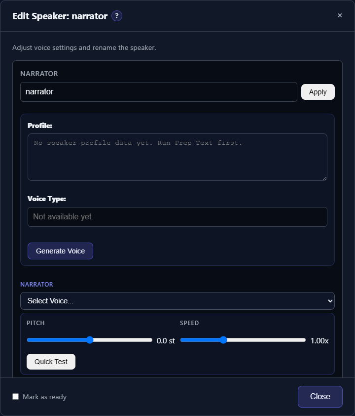

# First-Run Checklist

Use this checklist after TTS-Story has been installed and the browser interface has opened on the default **Generate** tab. Keep the TTS-Story terminal or launcher running while you use the browser interface. You do not need to install or configure every engine.

## 1. Confirm that the interface is connected

At the top of the page, review the status bar:

- **Mode** shows the currently selected engine or operating mode.
- **CUDA** reports whether the main environment can use an NVIDIA CUDA device.

A missing CUDA device is not a general failure. CPU engines and online services do not require CUDA. If the page does not populate or both indicators remain at **Loading...** or **Checking...**, restart TTS-Story before changing settings.

## 2. Choose a realistic first engine

Open [Settings](app:settings) and expand **Quick Settings**. Choose a **Default Engine** suited to this computer:

- NVIDIA GPU: a local GPU engine can provide privacy and avoid usage fees.
- CPU-only computer: Pocket TTS or KittenTTS is a practical local starting point.
- Internet connection with no speech API key: **Microsoft Edge TTS · Experimental Cloud** is easy to test, but its consumer service is unofficial and not guaranteed.
- Existing cloud account: use Replicate, Azure Speech, or ElevenLabs after configuring its credentials.

The saved default is only the starting selection for new work. The **Engine** field under **Generation Options** can override it for an individual job.

Select **Save Settings** after choosing the default, even when it is a local engine with no credentials to configure.

*Start in Quick Settings, keep the initial audio defaults, and save a known-good baseline before tuning.*

For a full comparison, read [Choose the Right Engine](help:choose-engine).

## 3. Configure only the services you will use

Still in **Settings**:

- Expand **Engine Settings** for a speech provider.
- Expand **LLM Pre-Processing** only if you plan to use **Prep Text**.
- Enter credentials directly into the password fields.
- Use the provider's **Test Connection**, **Load Voices**, **Load Catalog**, or **Fetch Models** control when available.
- Click **Save Settings** at the bottom of the page.

Atlas Cloud, OpenRouter, and Gemini are LLM providers; they prepare text but do not generate the final audio. Azure Speech, Edge TTS, ElevenLabs, and Replicate-backed engines generate speech.

Never paste a real API key into story text, project names, screenshots, logs, or issue reports. See [Configure Online Services Safely](help:online-services).

## 4. Confirm that the required voices are available

Return to [Generate](app:generate), select the intended **Engine** under **Generation Options**, and enter a short sentence. After automatic analysis, the **Assign Voices** section should appear.

The voice selector changes with the engine:

- Built-in engines show their preset voices.
- Cloning engines show locally saved **Voice Samples**.
- Azure Speech, Edge TTS, and ElevenLabs use catalogs loaded from their services.

If a cloud selector is empty, return to that engine's Settings panel and load its catalog again. If a cloning selector is empty, add a clean reference recording in [Available Voices](app:voices); see [Reference Voice Prompts](help:voice-prompts).

*After analysis, verify that every speaker card has a compatible voice before running a test.*

## 5. Run a short Quick Test

Assign one voice, leave **Pitch** and **Speed** at their defaults, and select **Quick Test**. The first local preview can be slower because a model may be loading or downloading. A successful second preview is a better measure of normal responsiveness.

If the preview fails:

1. Recheck the selected engine and voice.
2. For a cloud engine, retest credentials and confirm the account has quota.
3. For a local engine, allow any first-run model download to finish.
4. Restart after installing or updating dependencies.

Use [Troubleshooting Checklist](help:troubleshooting-overview) if the error persists.

## 6. Save a known-good baseline

Keep default audio and performance settings until a short generation completes successfully. Then change one setting at a time. For important work, save the current Generate-page state with **Manage Projects**, but remember that projects are stored only in this browser profile. They are not a substitute for backing up the original manuscript or the TTS-Story data folders.

You are ready for [Generate Your First Audio](help:quick-start).
