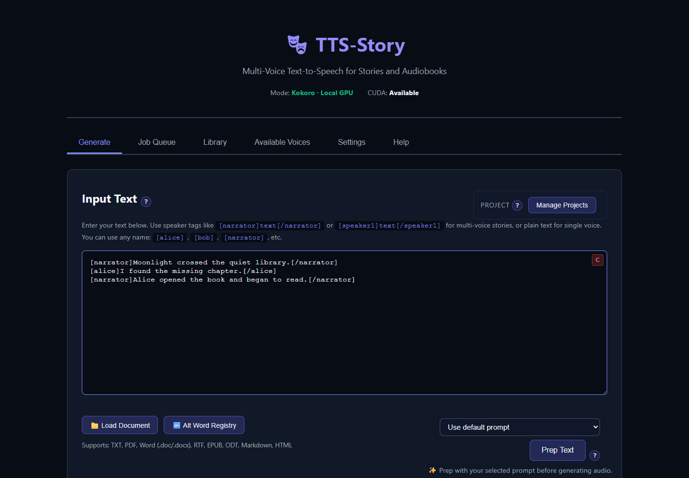
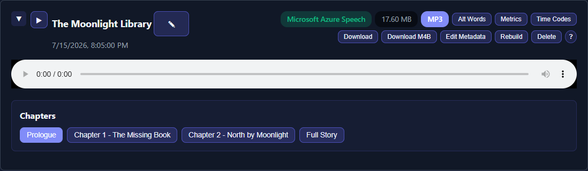

# How the Pages Work Together

TTS-Story uses one continuous workflow rather than separate project files for every stage. The Generate page prepares a job; Job Queue processes it; Library preserves completed work and its review data; Available Voices and Settings supply reusable resources.

## Workflow at a glance

```text
Settings + Available Voices
             |
             v
Input / import -> automatic analysis -> voice assignments -> Generate Audio
                                                            |
                                                            v
                                                        Job Queue
                                                            |
                                                            v
                                                         Library
                                                            |
                                      review / regenerate / rebuild / export
```



*Generate combines the manuscript, speaker assignments, engine, and output choices into a submitted job.*

## Settings supplies saved defaults

[Settings](app:settings) stores the default engine, engine-specific controls, cloud credentials, audio behavior, and LLM configuration. These settings affect future sessions and jobs unless a Generate-page control overrides them.

The **Engine**, output format, bitrate, ACX choice, section behavior, voice assignments, and some engine options selected on Generate travel with the submitted job. Changing Settings later does not rewrite an already queued job's choices.

## Available Voices supplies reusable voice resources

[Available Voices](app:voices) contains several different kinds of resources:

- Built-in Kokoro voices and previews
- Custom Kokoro blends
- Qwen3 and OmniVoice voice-creation tools
- Uploaded, designed, or downloaded **Voice Prompts** for cloning engines

Creating or downloading a voice does not automatically assign it to a speaker. Return to Generate, select a compatible engine, and choose it in **Assign Voices**. See [Voice Management Overview](help:available-voices).

## Generate creates a job snapshot

[Generate](app:generate) combines:

- Current input text
- Detected speakers and sections
- Per-speaker voices and FX
- Alternate word substitutions
- Selected engine and engine overrides
- Output and chapter options

Analysis runs automatically after input changes. Selecting **Generate Audio** performs a final analysis and validation before the job is added to the queue.

**Manage Projects** saves a reusable snapshot of much of this page, but only in the current browser's local storage. It does not save generated audio, API keys, or the actual reference-audio files. Read [Save and Restore Projects](help:projects) before relying on it.

## Job Queue owns active processing

[Job Queue](app:queue) is the authoritative view of queued and running work. Closing the Generate tab or preparing another story does not cancel a submitted job. Use the queue to interpret states, inspect progress, and pause, resume, or cancel where those controls are available. A failed job has no one-click Retry action; correct the cause and submit a new job from Generate.

An estimated completion time is not a promise. First-run downloads, GPU loading, cloud throttling, long chunks, and post-processing can all change it. See [Generation Time and ETA](help:generation-times).

## Library owns completed work

[Library](app:library) is more than a download list. Completed items retain metadata and chunk-review information that supports:

- Full-story and chapter playback
- Chunk- or speaker-level regeneration
- Text and voice corrections
- Rebuilding chapter or combined files
- Repairing missing review data when possible
- Alternate word updates for later regeneration
- Audiobook packaging and downloads

Delete and clear actions can remove generated files. Back up final exports before cleaning the Library. See [Use the Audio Library](help:audio-library).



*Completed work moves to Library, where you can listen, repair chunks, rebuild outputs, and export files.*

## Two different kinds of saved state

Do not confuse these:

| State | Location | Purpose |
|---|---|---|
| **Project** | Browser `localStorage` | Resume or duplicate Generate-page preparation. |
| **Job/Library item** | TTS-Story data and audio folders | Preserve submitted job metadata, chunks, and generated output. |

Neither replaces an external manuscript backup. Browser data can be cleared, and generated folders can be deleted from Library or the filesystem.

## Suggested checkpoints

1. Save the manuscript externally before import or LLM preparation.
2. Save a named project after speaker assignments are ready.
3. Generate one representative chapter.
4. Review and correct it in Library.
5. Save or overwrite the project only after you are satisfied with the revised preparation.
6. Export final files outside the application folder.
