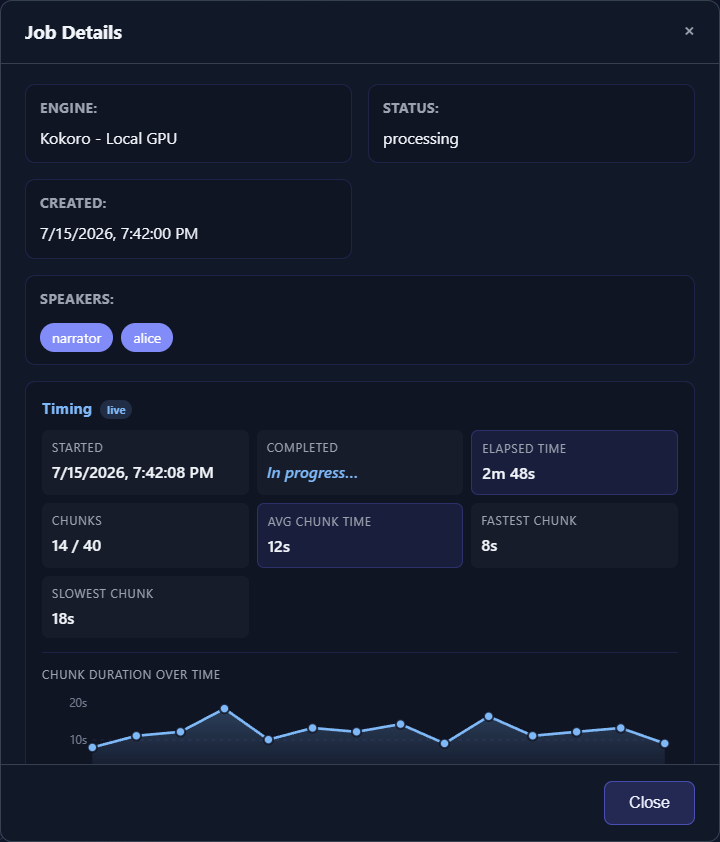

# Troubleshooting Checklist

Start by identifying the smallest stage that fails. Avoid deleting the job, Library item, configuration, or model cache until you have preserved the error and confirmed what is safe to rebuild.

## 1. Classify the problem

**Startup or interface:** The server does not start, a page does not load, or engine availability is false.

**Text analysis:** Speakers, chunks, or chapters are wrong before generation begins.

**Voice setup:** A catalog does not load, a prompt is missing, or Quick Test fails.

**Generation:** The job is queued, paused, interrupted, failed, or stuck processing.

**Audio quality:** Generation completes but pronunciation, pacing, voice identity, joins, or loudness are wrong.

**Export:** Library playback works, but a chapter, combined output, M4B, or time-code operation fails.

Use the matching section below instead of changing unrelated settings.

## 2. Preserve evidence

Before removing a failed job:

1. Open [Job Queue](app:queue) and record its full Job ID, engine, status, progress, and error from **Details**.
2. Preserve the terminal traceback or provider error.
3. Copy the per-job `job.log` from `static/audio/<job-id>/` if it exists.
4. Note exactly which action failed and whether it ever worked on this computer.
5. Remove credentials, private manuscript text, personal paths, and reference audio before sharing anything.



*Capture the non-sensitive status and error information from Job Details before deleting or retrying a failed job.*

Deleting a Library item removes its generated directory and job log.

## 3. Run a minimal test

Open [Generate](app:generate) and use one short paragraph with one speaker, the same engine, default engine parameters, no chapter splitting, and MP3 output. Assign one known-good built-in voice or prompt and run Quick Test before submitting.

- If the small test fails, investigate engine installation, credentials, model availability, or hardware.
- If it succeeds, add the original options back one at a time: speaker tags, reference prompt, effects, chapters, then the full manuscript.

This is faster and safer than repeatedly submitting the entire book.

## 4. Check application health

While TTS-Story is running, open `http://localhost:5000/api/health`. It reports engine availability, unavailable reasons for supported isolated/local engines, CUDA availability, VRAM counters, loaded engines, and whether Azure or ElevenLabs has required credentials configured. It does not return the key values.

Run the version report from the project directory:

```text
python scripts/engine_versions.py
```

Use `python scripts/engine_versions.py --json` only when machine-readable output is useful. IndexTTS, OmniVoice, and Dot.TTS use isolated environments, so their relevant identifiers/runtime state may differ from packages in the main environment.

## 5. Choose the next guide

- Authentication, quota, throttling, or provider timeout: [Cloud Credentials, Quota, and Network Errors](help:cloud-errors)
- CUDA, CPU, model download, isolated environment, or missing executable: [GPU, CPU, Model, and Dependency Errors](help:gpu-cpu-errors)
- Mispronunciation, pacing, prompt, or merge artifacts: [Fix Pronunciation, Pacing, Voice, and Merge Problems](help:audio-quality)
- Chunk-level correction after completion: [Review and Regenerate Chunks](help:job-review)
- A reproducible defect that remains: [Prepare a Useful Issue Report](help:report-an-issue)

Restarting can release models and recover an interrupted job, but it does not correct invalid text, credentials, or provider quota. Record the original failure before restarting.
