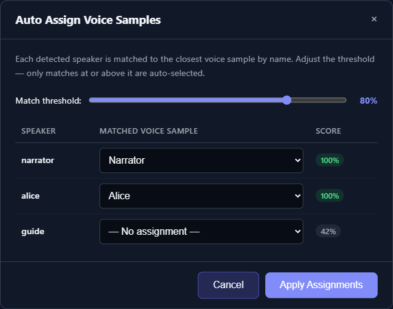

# Generate and Auto-Assign Voices

The Generate page offers two different automation tools. **Generate Voices** designs new reference samples from speaker profiles. **Auto Assign** matches detected speaker names to names already in the prompt library. Neither replaces listening to each assignment.

*Review every proposed name match and change any prompt selection before applying the assignments.*

## Generate Voices from profiles

Speaker profiles can be created after a successful Prep Text run, with **Build Profiles** for all detected speakers, or individually from Speaker Properties. If the text is already tagged, click a speaker chip and choose **Build Profile**; only that speaker's bounded tagged excerpts are analyzed, and the manuscript is not rewritten. Review and edit the returned Profile and Voice Type before using them.

To generate samples for all speakers:

1. Open [Generate](app:generate) and analyze the prepared text.
2. Confirm every detected speaker has a useful profile and voice type.
3. Click **Generate Voices**.
4. Choose Qwen3-TTS or OmniVoice.
5. Optionally enter a Name Prefix, such as the book title.
6. Click **Generate** and allow the sequential batch to finish.

For each speaker, TTS-Story generates a preview, saves it into Voice Prompts, refreshes the prompt list, and attempts to select the newly saved prompt for that speaker. The completion message reports how many voices succeeded.

This operation can be slow and can consume significant GPU resources. Test one voice through [Voice Creation](app:voices) before launching a large batch.

To build and design only one speaker, open that speaker's properties, click **Build Profile**, review the two generated fields, and then click **Generate Voice**. These buttons perform separate operations: Build Profile calls the configured LLM chain, while Generate Voice creates and saves the audio reference.

## Auto Assign existing prompts

Auto Assign compares each detected speaker tag name with saved prompt names using a text-name similarity score. It does not compare vocal sound and it does not semantically match the speaker profile.

1. Analyze the manuscript so speakers are visible.
2. Ensure the desired reference prompts exist and have recognizable names.
3. Click **Auto Assign**.
4. Adjust the Match Threshold; it starts at 80%.
5. Review every proposed prompt in the table.
6. Manually change or clear any dropdown.
7. Click **Apply Assignments**.

A threshold only controls whether the best name match is preselected. The table still lets you choose any listed prompt. Naming a prompt `narrator`, `alice`, or `Book Name alice` consistently makes this workflow more predictable.

Auto Assign populates reference-prompt assignments. It is not the right tool for engines that use only built-in voice catalogs, such as Kokoro, Azure, Edge TTS, or ElevenLabs; assign those voices manually.

## Verify the result

After either automation:

1. Click each speaker chip.
2. Confirm the selected engine and voice/prompt are compatible.
3. Play the raw prompt if available.
4. Run **Quick Test** with representative text.
5. Check language, transcript, speed, pitch, and silence controls.
6. Save a Project before making broad experiments.

Speaker “ready” state is only an organizational marker; it does not prevent generation with a missing or unsuitable assignment. The Generate action performs its own validation.

Continue with [Assign and Test Voices](help:assign-voices) or [Reference Voice Prompts](help:voice-prompts).
