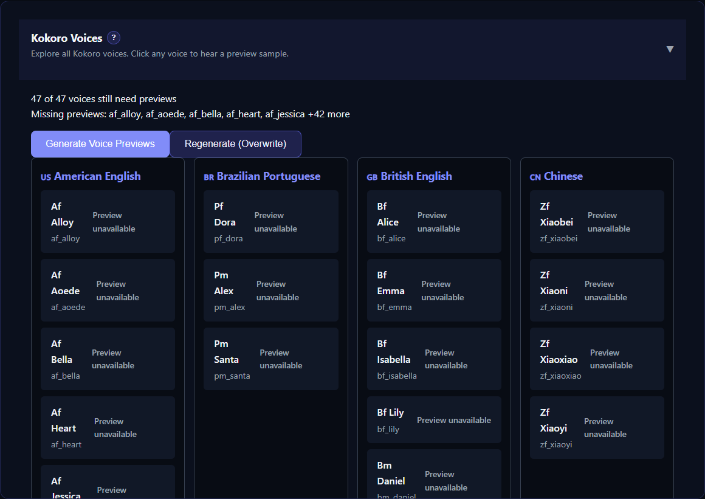

# Voice Management Overview

Open [Available Voices](app:voices) to maintain reusable voices before assigning them on Generate. The page has four independent sections:

1. **Kokoro Voices** for built-in voice previews.
2. **Custom Kokoro Voice Blends** for weighted combinations of compatible Kokoro voices.
3. **Voice Creation** for designing a sample with Qwen3-TTS or OmniVoice.
4. **Voice Prompts** for uploaded or generated reference clips used by cloning engines.

*Available Voices groups built-in catalogs, custom blends, designed voices, and reusable reference prompts in one workspace.*

These voice types are not interchangeable. A Kokoro voice code is selected from a built-in list, while a cloning engine expects a reference audio file. Qwen3 and OmniVoice design create audio that is then saved into the same reference-prompt library.

## Built-in voices

Kokoro, Pocket TTS Preset, Qwen3 Custom Voice, KittenTTS, Azure Speech, Edge TTS, and ElevenLabs use provider/model voice catalogs rather than a local reference recording. Their available voice lists depend on the selected engine and, for online providers, the configured account or live service catalog.

Kokoro previews are managed directly on Available Voices. See [Kokoro Voices and Previews](help:kokoro-voices).

## Reference prompts

Chatterbox, VoxCPM, Pocket TTS Clone, Qwen3 Clone, OmniVoice Clone, IndexTTS, and Dot.TTS can use saved reference audio. The engine may impose additional language, duration, transcript, or hardware requirements.

The Voice Prompts manager supports uploading, bulk importing, previewing, metadata editing, exporting, archiving, restoring, and deleting clips. There is no microphone recording control in the current interface; record and edit the clip in another application, then upload it. See [Reference Voice Prompts](help:voice-prompts).

## Designed voices

Qwen3-TTS and OmniVoice can synthesize a voice from written characteristics. Generate a preview, listen to it, and save an acceptable result to Voice Prompts. Saved output becomes a reference clip; the design mode itself is not selected as a normal narration engine on Generate.

See [Create Voices with Qwen3 or OmniVoice](help:voice-creation).

## Local and external prompt libraries

The prompt table combines local clips with external voices loaded from GitHub. **Load External Voices** requires internet access. Preview an external voice before downloading it; downloading creates a local copy that can be used by engines.

Use filters for name, source, gender, and language. Gender and language are organizational metadata and do not transform the audio.

**Archive** hides voices from the active list without deleting their files. **Unarchive** restores them. **Delete** is permanent, and an existing Project or Library item can retain a path to a voice that no longer exists. Export important clips before deletion.

## Assign voices to a manuscript

Return to [Generate](app:generate), analyze the text, and click a speaker chip. Select a compatible built-in voice or prompt, then use **Quick Test**. Assignment is per detected speaker and per selected job engine.

For the complete workflow, see [Assign and Test Voices](help:assign-voices) and [Generate and Auto-Assign Voices](help:auto-assign-voices).
