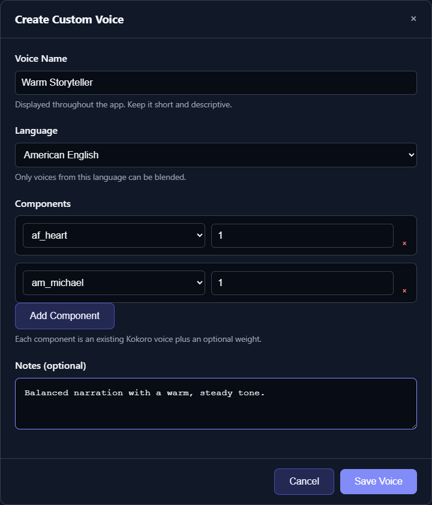

# Custom Kokoro Voice Blends

A custom Kokoro voice combines one or more built-in voice packs. One component creates a reusable custom alias for that voice; two or more components create an actual blend. It is reusable anywhere a Kokoro voice can be selected and requires no reference recording.

*Build a reusable blend by choosing same-language components and adjusting their relative weights.*

## Create a blend

1. Open [Available Voices](app:voices).
2. Expand **Custom Kokoro Voice Blends**.
3. Click **New Custom Voice**.
4. Enter a short, descriptive Voice Name.
5. Select the Language.
6. Add one or more component voices and assign each a positive weight.
7. Add optional notes and click **Save Voice**.

Only voices from the selected language are available as components. Supported groups are American English, British English, Spanish, French, Hindi, Japanese, Mandarin Chinese, and Brazilian Portuguese.

Weights are relative and are normalized during blending. A pair weighted `1` and `1` is an even blend; `3` and `1` gives the first component three times the influence of the second. Every component weight must be greater than zero.

## Develop a blend methodically

Start with two voices and equal weights. Test a short, representative passage, then change one weight at a time. Adding many voices can average away the characteristics you wanted.

A practical sequence is:

1. Identify one voice with the desired timbre.
2. Add one voice with the desired pacing or brightness.
3. Begin at `1 : 1`.
4. Move to `2 : 1` or `1 : 2` after listening.
5. Save notes describing the successful use case.

The blend is computed from Kokoro voice data, so it does not clone a real speaker and cannot reproduce performance details from a recording.

## Edit or delete a blend

Use **Edit** on its card to change the name, language, components, weights, or notes. Changing the language rebuilds the component choices because cross-language blends are rejected.

Use **Delete** only after checking saved Projects and planned jobs. A project may retain the deleted custom voice code and require a new assignment when loaded.

## Assign and test

Open [Generate](app:generate), select a Kokoro engine, click the speaker chip, and choose the custom name from the appropriate language group. Run **Quick Test** with the manuscript's actual language and punctuation.

For built-in catalog guidance, see [Kokoro Voices and Previews](help:kokoro-voices).
